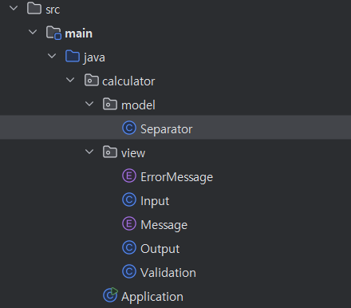
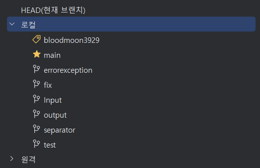
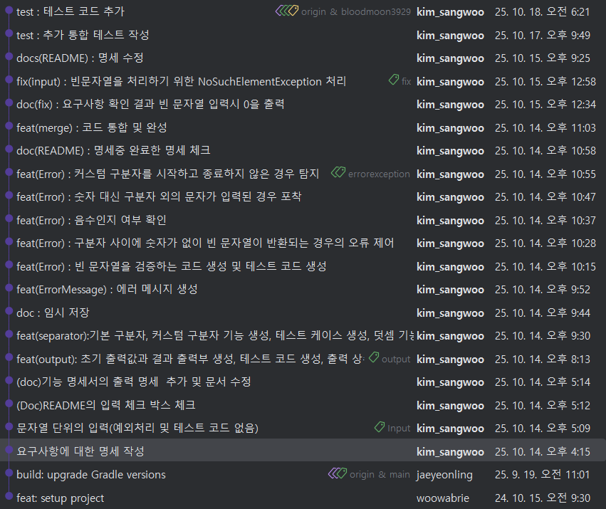

# 프리코스 1주차 과제
## 프리코스 1주차에서 배운점
1주차에서 가장 신경 쓴 점은 정석적인 코딩으로 미션을 진행하는 것이였다.

기존에는 일단 도전하고 문제가 생기면 수정하는 방식으로 막무가네로 미션을 진행하였다.

이는 추후 대규모 프로젝트를 진행할 때, 반드시 문제가 생기는 코딩 방법이라고 생각했다.

그래서 중점으로 두 가지는 꼭 지키자 하는 것이 있었다.

1. 개발 방향성을 잡고나서 개발을 진행하기
2. 올바른 git 문법 사용

### MVC 패턴
코드의 기본적인 토대는 MVC를 기반으로 진행하였다. 정확히는 완벽한 MVC 패턴은 아니고 controller의 기능을 Aplication이 담당하는 방식으로 구현 되었다.

이렇게 진행한 이유는 코드를 작성함에 있어 직관적인 코드를 작성하고 싶었고, controller를 만들지 않는 것이 더 직관적일 것이라고 생각했기 때문이다.

모델의 Separtor는 구분자 관련 함수만을 내장하며, Enum 형의 ErrorMessage와 Message는 코드에서 출력하는 문자열 함수를 내장하고 있다.

Validation은 Separator에서 생길수 있는 예외 상황을 검증해주는 역할을 한다.

### public vs private
1주차 미션을 수행함에 있어 모든 메서드를 public으로 만들었다. 

이는 좋지 않은 것을 알고 있으나 이렇게 진행한 이유는 TDD를 진행함에 있어 함수가 각각의 기능을 하는지 테스트 하기 위해서 였다.

이 부분은 더 자료를 읽고 해결 방안을 적용할 것이다.

### 예외 케이스
- [ ] 빈 문자열이 입력으로 온 경우
- [ ] 구분자와 구분자 사이에 빈 문자열이 있는 경우
- [ ] 음수나 0의 입력을 받은 경우
- [ ] '//'로 시작하지만 '\n'으로 커스텀 구분자를 닫지 않는 것
- [ ] 구분자 외의 문자가 입력된 경우

### git branch

다음은 사용한 브랜치이다.

사용하고자 한 방식은 git-flow 방식이였으나 브랜치의 이름 컨벤션이 맞지 않다. 

기존에는 github desktop을 사용하여 관리 하였으나 git에 익숙해지기 위해 git bash로 진행하였기에 완벽하지 않지만 차차 개선할 계획이다.

git log를 보면 이번 주차를 진행하며 가장 중요하게 생각한 것은 한가지의 기능을 개발하고 커밋을 진행하는 것이였다.

우아한 형제들의 gitflow에 대한 블로그를 보았는데 rebase를 하여 커밋을 합치는 것을 권고 하였으나, 뒤늦게 확인하여 적용하지 못했다. 하지만 기능에 대한 "커밋이 많지 않은데 굳이 합칠 이유가 있을까?" 라는 고민을 하고 있다.

## 7기와 비교하여 성장한 점
[7기 당시의 코드](https://github.com/bloodmoon3929/java-calculator-7/tree/bloodmoon3929)

### 사용한 IDE
올해 프리코스에서는 IntelliJ를 사용했으나 과거에는 VSC에서 모든 코드를 관리하고 싶었기에 VSC로 진행하였다. 

하지만 이는 IDE 자체의 성능이 저하되어 좋지 않은 선택이였고, 2주차때 IntelliJ로 바꿨었다.

### 명세
올해는 모든 명세를 작성하고 코드를 작성하였다. 하지만 이 당시에는 무식하게 진행하던 시기여서 문제가 발생 할때마다
README에 명세v{n} 이런식으로 명세를 추가하였다. 이는 코드를 리뷰하는 사람으로 하여금 나의 코드를 이해하기 힘들게 한 것 같다.

### 디자인 패턴
올해는 야매지만 MVC 패턴을 적용하려 하였으나, 당시에 Java에 익숙하지 않던 시기에는 Application에 모든 코드를 정적으로 작성하였다. 이는 객체 지향인 Java의 특성을 살리지 못한 안좋은 결정이였다.

## 최종 후기
이번 주차에는 갑자기 남원시에서 개최되는 moblity 해커톤 대회 일정이 잡히는 바람에 모든 시간을 사용하지 못했다. 그러기에 다음 주차에서는 온전히 우아한 테크 코스에 힘을 쏟고 싶다.