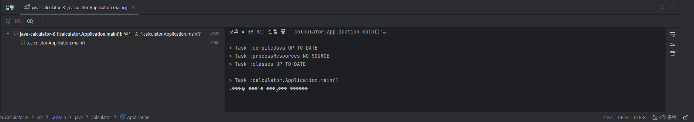
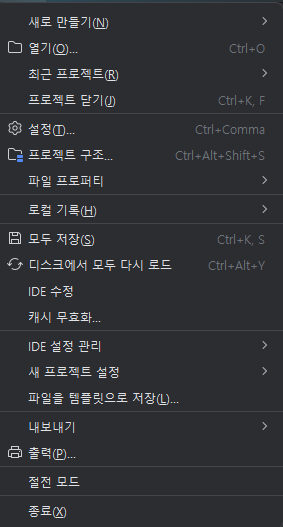
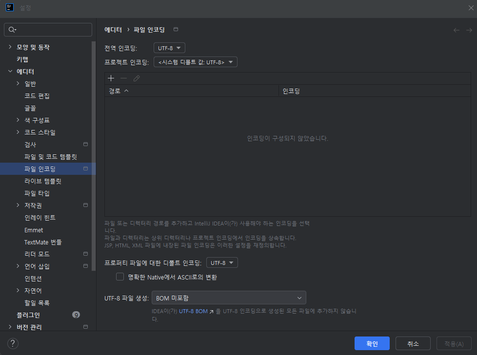
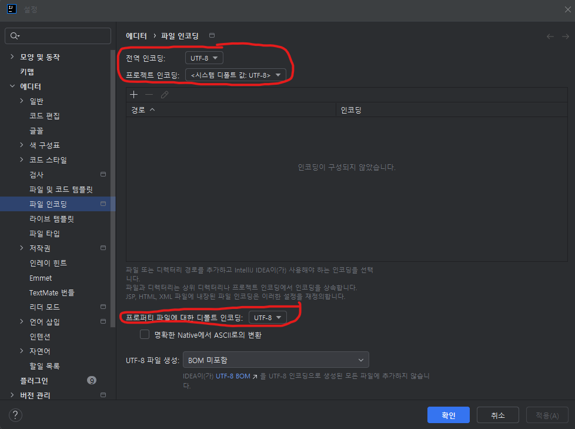
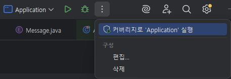
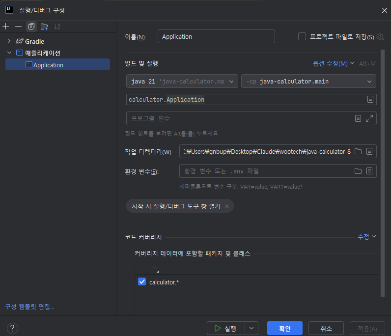
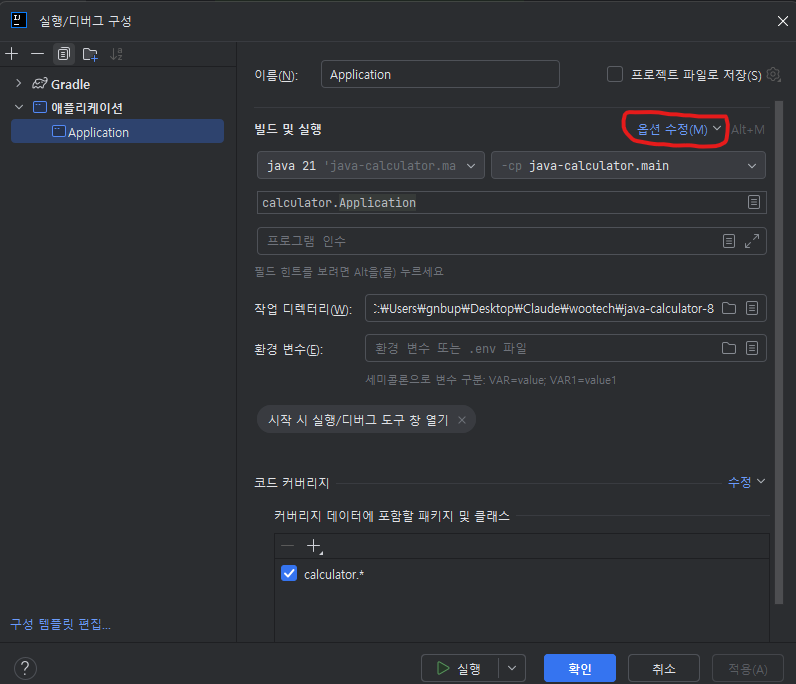
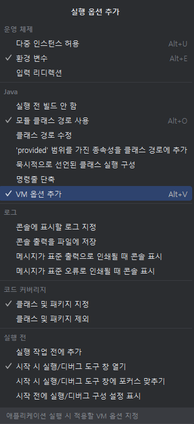
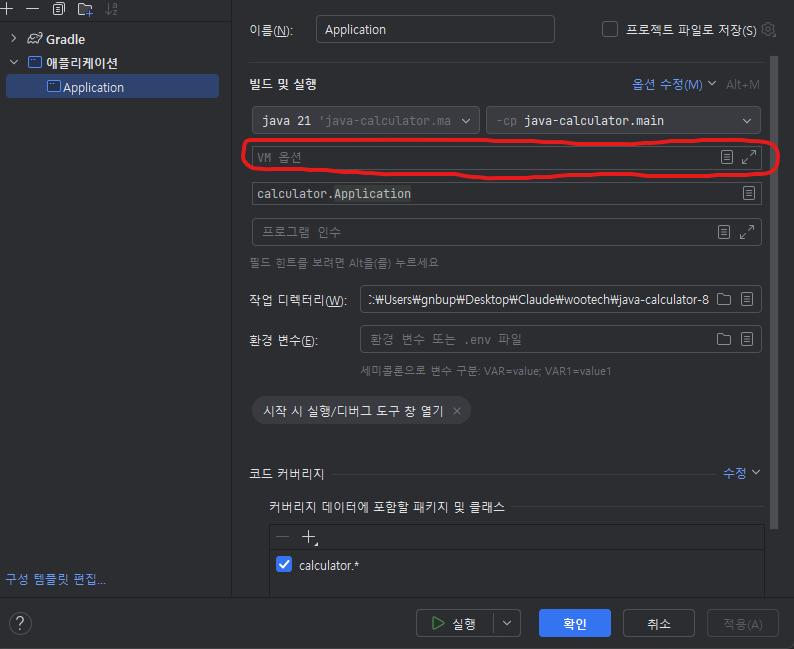

# IntelliJ 한글 깨짐 문제
프리코스를 진행하면서 사용한 IDE를 IntelliJ를 선정하게 되었다.

그러면서 코딩과 관련없는 문제가 생겼는데,



터미널에서 글자가 깨진다는 것이다. 입력도 정상적으로 받고, 영어로 된 출력은 정상적으로 받는 문제가 생겼다

이를 해결한 방법은 다음과 같다.

---

## 해결 방안
문제의 원인은 IntelliJ의 문자 인코딩 방식은 UTF-8방식이지만 터미널은 ASCII값을 출력하기에 문자가 깨지는 문제가 생기는 것이다.

이를 해결하기 위해



파일/설정에 들어간다.



```
> 에디터
    > 파일 인코딩
```


빨간 색으로 표시한 부분을 전부 UTF-8로 변경해주면 된다.

---

이것만으로는 해결 되지 않을 것이다.


해당 메뉴에서 구성 편집을 해줘야 한다.


기존의 메뉴 구성은 다음과 같을 것이다.


옵션 수정 버튼을 눌려 VM 옵션을 추가해 주어야 한다.




그러면 이전에 없었던 VM 옵션 창이 생긴다.



이 창에 다음의 명령어를 추가 해주면 된다.

`-Dfile.encoding="UTF-8" -Dsun.stderr.encoding="UTF-8" -Dsun.stdout.encoding="UTF-8"`


이제 문제가 해결된 것을 알 수 있다.

필요하다면 구성 템플릿 편집을 통해 단위 테스트에서의 문제도 해결 할 수 있을 것이다.