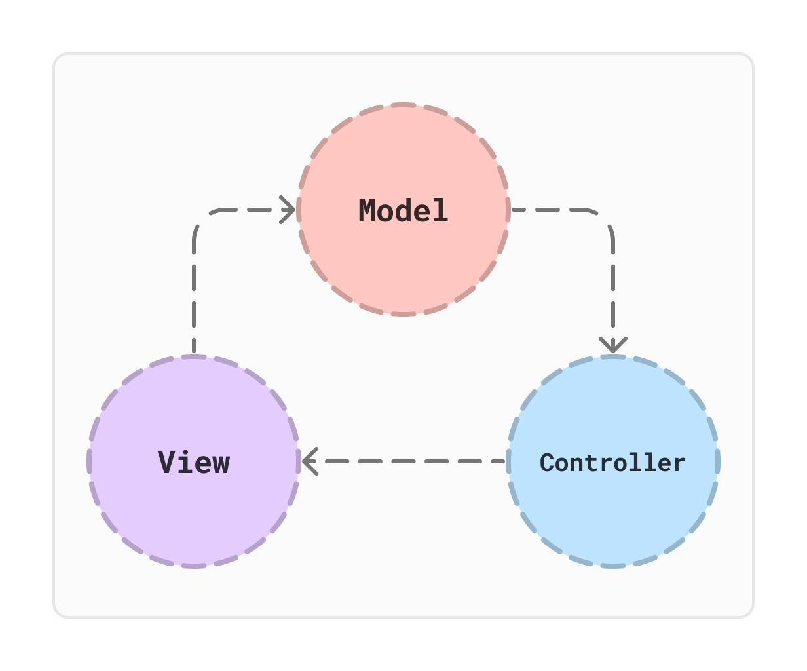
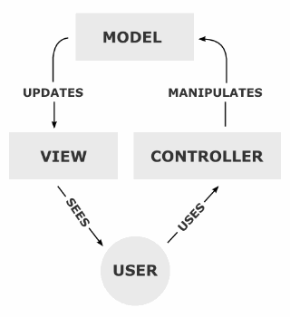
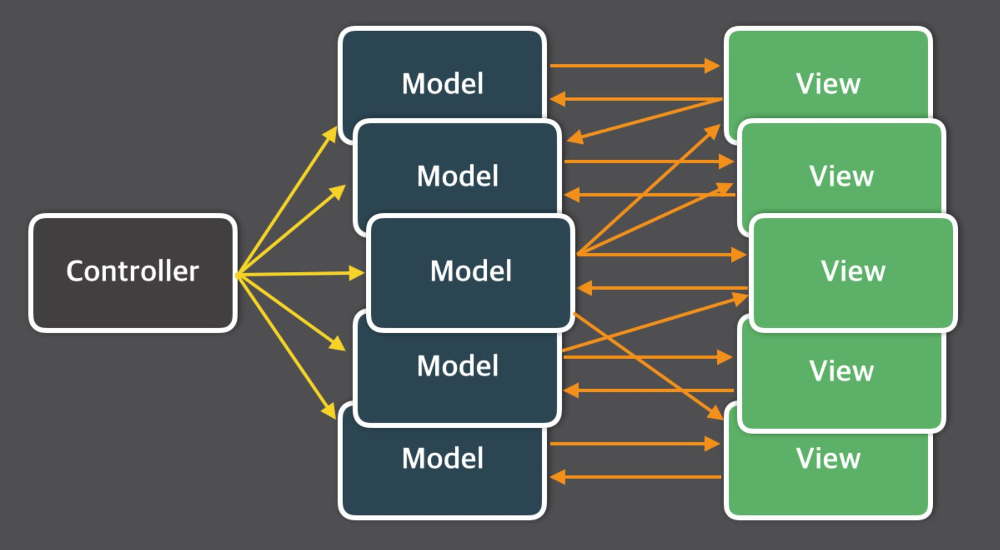
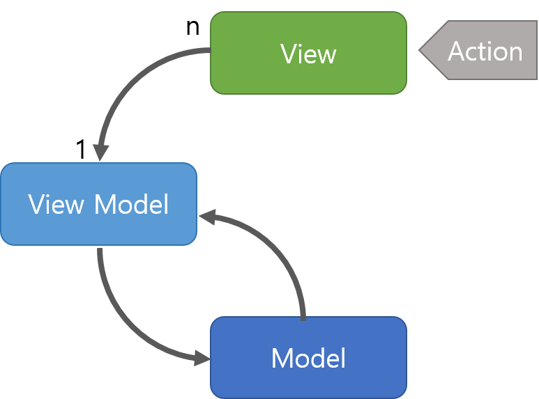
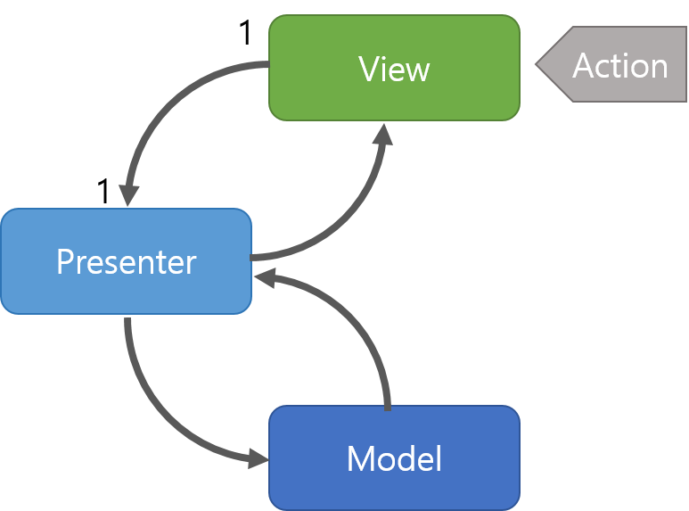

# MVC 패턴


MVC(모델-뷰-컨트롤러)는 사용자 인터페이스, 데이터 및 논리 제어를 구현하는데 널리 사용되는 소프트웨어 디자인 패턴입니다. 소프트웨어의 비즈니스 로직과 화면을 구분하는데 중점을 두고 있습니다. 이러한 "관심사 분리" 는 더나은 업무의 분리와 향상된 관리를 제공합니다. MVC 에 기반을 둔 몇 가지 다른 디자인 패턴으로 MVVM (모델-뷰-뷰모델), MVP (모델-뷰-프리젠터), MVW (모델-뷰-왓에버)가 있습니다.

MVC 소프트웨어 디자인 패턴의 세 가지 부분은 다음과 같이 설명할 수 있습니다.

```
모델: 데이터와 비즈니스 로직을 관리합니다.
뷰: 레이아웃과 화면을 처리합니다.
컨트롤러: 모델과 뷰로 명령을 전달합니다.
```



## 모델
Model은 소프트웨어나 어플리케이션에서 정보 및 데이터 부분을 의미한다. 이는 controller에게 받은 데이터를 조작하는 역할을 수행한다고 볼 수 있다. 

> 1. 사용자가 편집하길 원하는 모든 데이터를 가지고 있어야 한다.
> 2. View나 Controller에 대해서 어떤 정보도 알지 말아야 한다.
> 3. 변경이 일어나면, 변경 통지에 대한 처리방법을 구현해야만 한다.

## 뷰
View는 입력값이나 체크박스 등과 같은 사용자 인터페이스 요소를 나타낸다. 이는 Controller에게 받은 Model의 데이터를 사용자에게 시각적으로 보여주기 위한 역할을 수행한다.

> 1. Model이 가지고 있는 정보를 따로 저장해서는 안된다.
> 2. Model이나 Controller를 알고 있을 필요가 없다.
> 3. 변경이 일어나면 변경통지에 대한 처리방법을 구현해야만 한다.

## 컨트롤러
Controller는 Model과 View 사이에서 데이터 흐름을 제어한다. 사용자가 접근한 URL에 따라 요청을 파악하고 URL에 적절한 Method를 호출하여 Service에서 비즈니스 로직을 처리한다. 이 후 결과를 Model에 저장하여 View에게 전달하는 역할을 수행한다. 결국 Controller는 Model과 View의 역할을 분리하는 중요한 요소이다.

> 1. Model이나 View에 대해서 알고 있어야 한다.
> 2. Model이나 View의 변경을 모니터링 해야 한다.


## 이점

> 1. 컴포넌트의 명확한 역할 분리로 인해 서로간의 결합도를 낮출 수 있다.
> 2. 코드의 재사용성 및 확장성을 높일 수 있다.
> 3. 서비스를 유지보수하고 테스트하는데 용이해진다.
> 4. 개발자 간의 커뮤니케이션 효율성을 높일 수 있다.

# 한계점

> 1. Model과 View의 의존성을 완전히 분리시킬 수 없다.
> 2. 컨트롤러의 비중이 높아져 부담이 커진다면 Massive-View-Controller 현상을 피할 수 없다.

## Model과 View의 의존성을 완전히 분리시킬 수 없다
Controller는 여러 개의 model과 view를 가질 수 있고, 이로 인해 Model과 view는 controller에 의래 복잡하게 연결되어 서로간의 의존성이 커질수 있다.

## 컨트롤러의 비중이 높아져 부담이 커진다면 Massive-View-Controller 현상을 피할 수 없다
Massive-View-Controller는 MVC 패턴에서 컨트롤러의 역할이 과도하게 커지고 복잡해지는 상황을 지칭한다.



[Limitations of MVC Pattern](https://www.infoq.com/news/2014/05/facebook-mvc-flux/)의 문서처럼 규모가 복잡하고 큰 서비스의 경우 하나의 controller에도 수많은 View와 Model이 연결되어 있기에 Controller의 부하가 커진다.

## MVVM

MVVM 패턴은 MVC의 한계를 극복하기 위해 개발된 패턴중 하나로 Model, View, ViewModel 요소로 이루어진 소프트웨어 아키텍처 패턴이다.

Viewmodel은 View와 Model 사이에서 중개자 역할을 수행하며, View를 보여주기 위한 데이터 처리 역할을 수행하는 요소이다. 즉, View를 표현하기 위해 만들어진 Model이라고 보면 된다.

MVVM 패턴은 Command 패턴과 Data Binding 패턴, 2가지 패턴을 활용하여 구현되었으며, 이 패턴들을 통해 View와 Model 사이에 연관되는 의존성을 제거하였다.

하지만 결국 MVC 패턴에서의 View와 Model의 의존성 문제를 해결할 수 있었지만 Viewmodel을 설계하는 과정이 복잡하고 어렵다는 단점 또한 존재한다.

> 1. 사용자의 요청은 View를 통해 받게 된다.
> 2. View에서 요청을 받는다면, Command 패턴으로 View Model로 요청을 전달한다.
> 3. View Model은 Model에게 요청 처리에 필요한 데이터를 요청한다.
> 4. Model은 내부적으로 비즈니스 로직을 수행하여 View Model에게 필요한 데이터를 전달한다.
> 5. View Model은 전달받은 데이터를 가공하여 저장한다.
> 6. View는 View Model과 Data Binding하여 사용자에게 요청에 적절한 화면을 출력한다.

## MVP

MVP 패턴 또한 MVC 패턴의 단점을 보완하기 위해 등장한 패턴으로, Model, View, Presenter로 구성되는 소프트웨어 아키텍처 패턴이다.

Presenter는 Model과 View 사이에서 중개자 역할을 하며, MVC에서의 Controller와 유사하지만, View에서 요청한 정보를 통해 Model을 가공하여 View로 전달해주는 방식을 취한다.

MVP 패턴도 MVVM 패턴과 유사하게 Presenter를 통해서만 데이터를 전달받기 때문에 MVC 패턴의 약점 중 하나인 View와 Model의 의존성을 제거해줄 수 있었다.

다만, MVP 패턴은 View와 Presenter 사이의 의존성이 높아지게 된다는 단점이 있다.

> 1. 사용자의 요청은 View를 통해 받게 된다.
> 2. View는 데이터를 Presenter에 요청한다.
> 3. Presenter는 Model에게 데이터를 요청한다.
> 4. Model은 요청을 통해 비즈니스 로직을 수행하여 Presenter에서 요청받은 데이터를 전달한다.
> 5. Presenter는 View에게 전달받은 데이터를 응답한다.
> 6. View는 Presenter가 응답한 데이터를 이용하여 화면을 출력한다.
