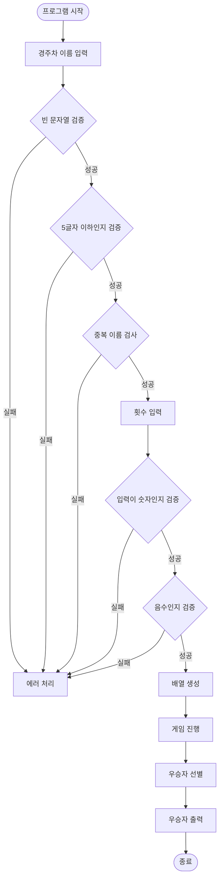
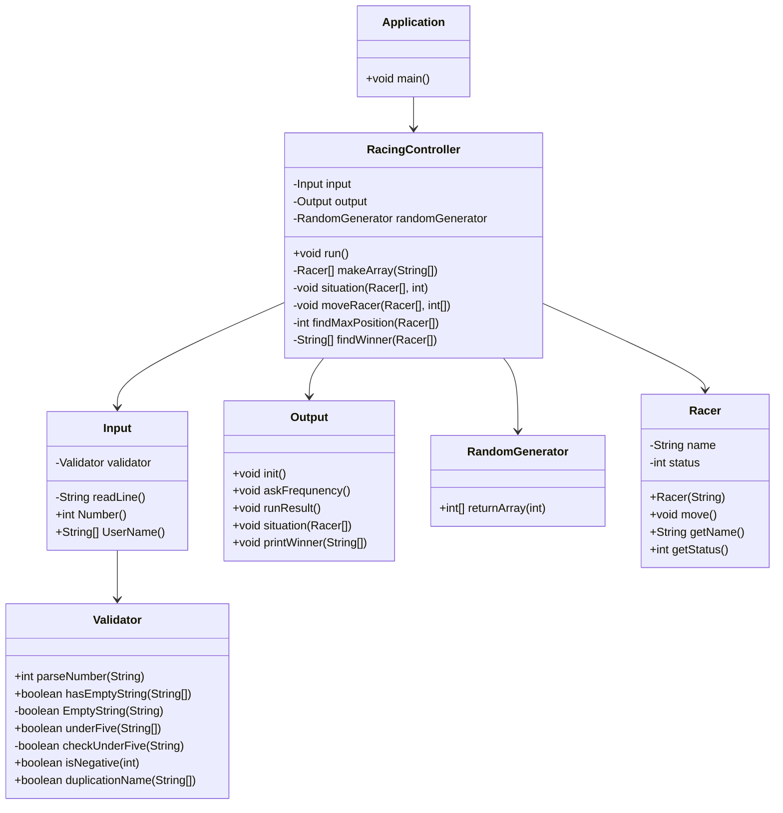
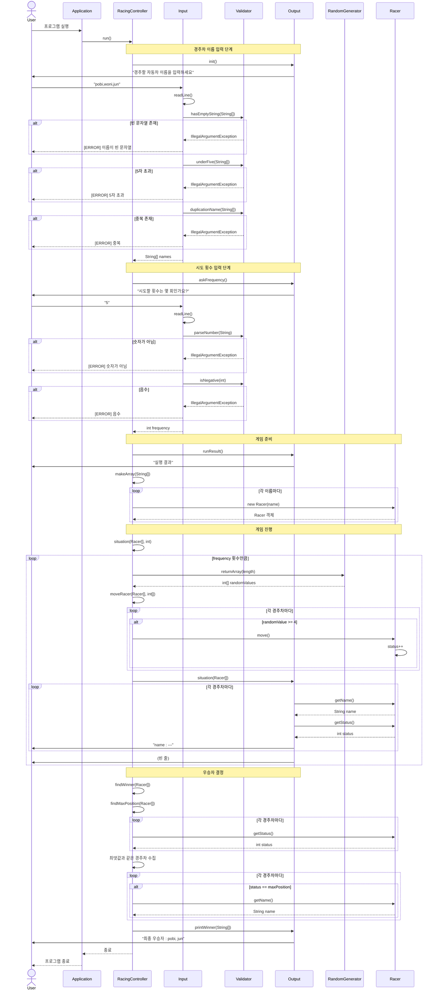

# 프리코스 2주차 과제
## 프리코스 2주차에서 배운점
이번 기수에서는 코드 리뷰를 굉장히 중요히 여기고 최대한 소통하는 것을 중요히 여기는 것 같았다. 그래서 많은 코드를 둘러보고 많은 것을 배운 것 같다.

그 중 우아한 형제들의 gitflow 관련 글에서 Jira에 대해 보게 되었고, 이는 프로젝트를 진행함에 있어 소통을 도와주는 도구라고 생각하여 사용하여 보았다. 

추가로 이전에는 README는 나만 알아보면 된다고 생각하였으나 코드 리뷰하며 README가 작성되있지 않거나 내용이 빈약하면 코드의 의도를 간편히 이해하기 힘들다 생각하게 되었고 README 정리하는 것을 큰 가치로 두었다.

### 개선된 MVC
1주차 미션을 보면 Controller가 없었다. 이 때는 굳이 컨트롤러를 만들어야 되는지에 대한 의문이 있었고, 클래스가 많아질 수록 가독성만 떨어진다고 생각하였다. 그렇기에 굳이 컨트롤러를 만들지 않고, Aplication이 그 역할을 하게 하였다. 

1주차에는 TDD를 진행하겠다고 모든 메서드를 public으로 공개했었는 데, 이것은 TDD가 원하는 바가 아니라고 생각하여, 필요한 메서드만 public으로 하고, public 메서드가 호출하는 private 메서드에 대한 테스트 케이스를 public 메서드 선에서 확인하도록 하여 개선하였다.

### Jira
Jira는 Atlassian에서 개발한 이슈 및 프로젝트 관리 도구이며 핵심 기능 다음과 같습니다.
1. **이슈 추적** : 버그, 작업, 개선사항 등의 이슈를 관리할 수 있는 기능을 제공합니다.
2. **프로젝트 관리** : 프로젝트의 목표, 마일스톤, 작업 할당 등을 관리할 수 있도록 도와줍니다.
3. **애자일 보드** : 칸반(Kanban) 보드와 스크럼(Scrum) 보드를 제공하여 애자일 팀이 스프린트를 계획하고 진행 상태를 추적할 수 있도록 지원합니다.
4. **보고서 및 대시보드** : 다양한 보고서와 대시보드를 제공하여 프로젝트의 진행 상황, 팀의 성과 등을 시각적으로 분석할 수 있도록 도와줍니다.
5. **통합 및 확장성** : Confluence, Bitbucket, GitHub 등 다양한 도구와 통합이 가능하며, 플러그인과 애드온을 통해 기능을 확장할 수 있습니다.

사용하면서 가장 중요하게 생각한 것은 Github와 연동할 수 있다는 것이였으나, 이를 적용하는 것은 실패하였습니다.

Jira를 사용하면서 느낀 점은 만일 팀 단위로 사용한다고 하면, 이슈에 대한 역할과 임무를 분명하게 정하고 일을 진행할 수 있다는 것과 이슈의 현재 상태를 한눈에 보기 용이하며, 알림을 통해 이슈의 마감기간에 대해서 리마인드 해주기에 일정 관리에 큰 도움이 될 것이라고 생각하였습니다.


Jira를 사용하면서 원래 Epic은 규모가 큰 단위의 작업을 나타내고, 장기간에 걸쳐 완료되어야 하는 작업이였으나 기능 별로 Epic을 만들어 그 안에 세분화 된 sub Task들을 해결해 나가는 식으로 진행하였습니다.

다음은 실제로 진행하면서 만든 타임라인 입니다.


만들어야 하는 큰 기능을 클래스로 구분하고, 그 클래스 안에 구현해야 되는 작은 단위의 기능들을 task로 잡아서 타임라인을 만들었습니다.


타임 라인을 보면서 현재 완료된 기능은 무엇인지, 우선 순위가 어디가 높은지 확인하며 댓글을 통해 이슈를 남길 수도 있습니다.


마지막으로 보드를 통하여 해야 할 일, 진행 중, 완료를 한눈에 볼 수 있었습니다. 

다만 Jira를 github의 git log 대신하여 형상관리를 하는 것이라고 들었는데, 이는 1인 프로젝트에서는 굳이 필요 없을 것 같으며, README의 check list가 현재 Jira의 역할을 하기에 프로 코스중에는 굳이 시도할 필요가 없을 것 같다.

### Mermaid
1주차 부터 코드를 짜면서 가장 먼저하는 것이 플로우 차트를 만드는 것이였다. 
Mermaid를 몰랐던 과거에는 종이에 손으로 플로우 차트를 만들었고, 이를 보며 로직을 떠올렸다.

하지만 이 방식은 손으로 그린 것이기에 README에 올리는 것에 제약사항이 있었다. 우선 그림이 완벽하지 않아 보는 이들에서 오히려 이해를 방해할 수 있으며, 수정 사항이 생겼을 때마다 손으로 다시 그리고 이를 사진으로 업로드 해야하는 불편함이 있어 기존에는 이를 올리지 않았다.

그러다 코드 리뷰를 하던 중 mermaid를 활용하여 다이어그램을 작성한 사람을 보게 되었다. 코드도 크게 어렵지 않았기에 이를 적용하여 코드 리뷰하기 쉽게 하는 것을 목표로 하였다.

다음은 실제로 추가한 다이어 그램과 프로젝트, 클래스 구조이다.
#### 프로젝트 구조
```text
    java-racingcar-8/
    ├── src/main/java/racingcar/
    │   ├── Application.java
    │   ├── controller/
    │   │   └── RacingController.java
    │   ├── model/
    │   │   ├── Racer.java
    │   │   └── RandomGenerator.java
    │   └── view/
    │       ├── Input.java
    │       ├── Output.java
    │       ├── Validator.java
    │       ├── Message.java
    │       └── ErrorMessage.java
```

#### Application 클래스

|메서드|기능|접근제어자|반환타입|매개변수|
|---|---|---|---|---|
|main()|프로그램 진입점, RacingController 실행|public static|void|String[]|

---

#### RacingController 클래스

|메서드|기능|접근제어자|반환타입|매개변수|
|---|---|---|---|---|
|run()|게임 전체 흐름 제어 (입력→실행→출력)|public|void|-|
|makeArray()|이름 문자열 배열을 Racer 객체 배열로 변환|private|Racer[]|String[]|
|situation()|게임 진행 (n회 반복, 랜덤 생성, 이동, 출력)|private|void|Racer[], int|
|moveRacer()|랜덤값 4 이상인 경주차들 전진|private|void|Racer[], int[]|
|findMaxPosition()|경주차 중 최대 위치값 찾기|private|int|Racer[]|
|findWinner()|최대 위치의 경주차 이름들 반환|private|String[]|Racer[]|

---

#### Racer 클래스 (Model)

|메서드|기능|접근제어자|반환타입|매개변수|
|---|---|---|---|---|
|Racer()|생성자, 이름 설정 및 위치 0 초기화|public|-|String|
|move()|현재 위치 1 증가|public|void|-|
|getName()|경주차 이름 반환|public|String|-|
|getStatus()|경주차 현재 위치 반환|public|int|-|

---

#### RandomGenerator 클래스 (Model)

|메서드|기능|접근제어자|반환타입|매개변수|
|---|---|---|---|---|
|returnArray()|0~9 사이 랜덤 숫자 배열 생성|public|int[]|int|

---

#### Input 클래스 (View)

|메서드|기능|접근제어자|반환타입|매개변수|
|---|---|---|---|---|
|readLine()|Console에서 입력 받기, 예외 처리|private|String|-|
|Number()|시도 횟수 입력 및 검증 (숫자, 음수)|public|int|-|
|UserName()|경주차 이름 입력 및 검증 (빈 문자열, 길이, 중복)|public|String[]|-|

---

#### Output 클래스 (View)

|메서드|기능|접근제어자|반환타입|매개변수|
|---|---|---|---|---|
|init()|경주차 이름 입력 안내 메시지 출력|public|void|-|
|askFrequency()|시도 횟수 입력 안내 메시지 출력|public|void|-|
|runResult()|"실행 결과" 메시지 출력|public|void|-|
|situation()|각 경주차의 현재 위치 출력|public|void|Racer[]|
|printWinner()|최종 우승자 출력|public|void|String[]|

---

#### Validator 클래스 (View)

|메서드|기능|접근제어자|반환타입|매개변수|
|---|---|---|---|---|
|parseNumber()|문자열을 정수로 변환, 예외 처리|public|int|String|
|hasEmptyString()|배열 내 빈 문자열 검증|public|boolean|String[]|
|EmptyString()|단일 문자열이 비어있는지 검증|private|boolean|String|
|underFive()|배열 내 모든 문자열 길이 5 이하 검증|public|boolean|String[]|
|checkUnderFive()|단일 문자열 길이 5 이하 검증|private|boolean|String|
|isNegative()|숫자가 음수인지 검증|public|boolean|int|
|duplicationName()|이름 중복 검증 (HashSet 사용)|public|boolean|String[]|

---

#### Message 클래스 (Enum)

|상수|값|용도|
|---|---|---|
|COLON|" : "|출력 포맷용 구분자|
|HYPHEN|"-"|경주차 위치 표시|
|WINNER|"최종 우승자"|우승자 출력 레이블|
|INIT|"경주할 자동차 이름을 입력하세요.(이름은 쉼표(,) 기준으로 구분)"|이름 입력 안내|
|FREQUNENCY|"시도할 횟수는 몇 회인가요?"|횟수 입력 안내|
|RUNRESULT|"실행 결과"|실행 결과 헤더|

---

#### ErrorMessage 클래스 (Enum)

|상수|값|용도|
|---|---|---|
|ERROR|"[ERROR]"|에러 메시지 접두사|
|NOINPUT|"입력을 받지 못했습니다."|입력 없음 에러|
|EMPTYSTRING|"이름이 빈 문자열 일 수 없습니다."|빈 문자열 에러|
|NEGATIVE|"입력이 음수 입니다."|음수 입력 에러|
|DUPLICATION|"경주차의 이름이 중복되었습니다."|이름 중복 에러|
|UNDERFIVE|"이름은 다섯 글자 이하여야 합니다."|길이 초과 에러|
|NOTNUMBER|"숫자가 아닙니다."|숫자 형식 에러|

#### 플로우 차트

#### 클래스 다이어그램


#### 시퀀스 다이어그램


이 PR을 올리고 Github에서 레포를 보게 되었는데, 너무 많은 정보는 오히려 가독성을 떨어뜨리는 것 같다는 느낌을 받았다. 그래서 이번 주차부터는 꼭 필요한 것만 추가하여 한다.

## 7기와 비교하여 성장한 점
[7기 당시의 코드](https://github.com/bloodmoon3929/java-racingcar-7/tree/bloodmoon3929)

### IntellJ 한글 깨짐
이번 1주차에 해결한 한글 깨짐 문제를 이 당시에는 해결하지 못하였고, 미봉책인 터미널을 사용하여 진행하였었다.

### 빈약한 예외처리
이 당시에는 문제에서 제시한 최소한의 예외처리만 하였었다. 하지만 이번에는 문자열에 대한 예외처리도 꼼꼼하게 진행하였다.

### Java 컨벤션의 부족
이 당시에는 Java 컨벤션 역시 잘 지키지 않은 것을 알 수 있다. 지금도 컨벤션이 틀리는 것이 나오기는 하겠지만, 메서드 이름에 대한 컨벤션이 지켜지지 않아, 지금 다시 코드를 리뷰하며 무슨 기능을 가지는 지 확인하는 데에 있어 오랜 시간을 사용하였다. 이는 코드의 유지 보수가 힘들다는 것을 직접 경험하게 된 것 같다.

## 최종 후기
MVC 패턴에 대한 이해가 아직 많이 부족한 것 같으며, 디자인 패턴에 대해 다시 공부할 필요가 있을것 같다.

Java 컨벤션을 지키지 않으면, 코드의 유지 보수성이 떨어진다는 것을 다시금 느끼게 되었고, 이를 최대한 지키겠다고 생각하게 되었다.