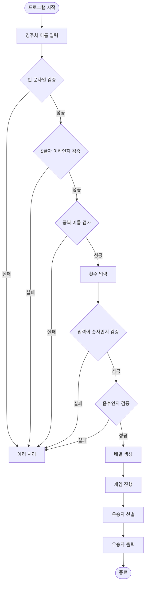
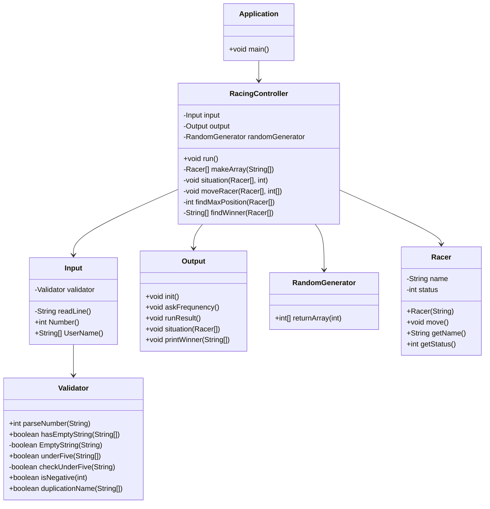
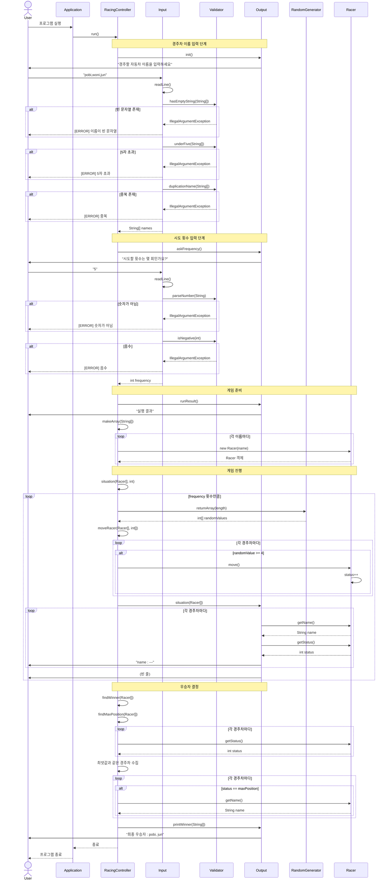

# 미션 간단 설명
사용자에서 경주차의 이름과 반복 횟수를 물어보고 해당 횟수만큼 전진 여부를 결정한다.
4/9 확률로 전진하며, 경주를 마치고 최종 우승자들을 출력하면 되는 문제이다.

## 요구사함
### 기능 요구사항

- [X] 입력
  - [X] 경주차 이름 입력 
  > 한 줄의 입력으로 받으며, 문자열로 받는다.
  - [X] 시도할 횟수 
  > int 형으로 받는다.
  - [X] ,를 구분자로 문자열 분리

- [X] 출력
  - [X] 경주차 이름 입력을 요구
  > 경주할 자동차 이름을 입력하세요.(이름은 쉼표(,) 기준으로 구분)
  - [X] 횟수를 입력 요구
  > 시도할 횟수는 몇 회인가요?
  - [X] 차수별 실행 결과
  > 객체 배열로 이름(문자열)과, 현재 상태(int)를 전달
  - [X] 우승자 출력
  > 배열로 입력을 받아서, 배열에 있는 모든 문자열을 출력; 한명 이상일시 ,로 구분

- [X] 랜덤 함수
> 0~9사이의 숫자 출력

- [X] 에러 처리
  - [X] 빈 문자열을 받은 경우
  > [ERROR] 입력을 받지 못하였습니다.
  - [X] 구분자로 분리한 문자열이 빈 문자열인 경우
  > [ERROR] 경주 자동차의 이름이 결정되지 않았습니다.
  - [X] 이름은 5자 이하만 가능
  > [ERROR] 이름은 5자 이하여야 합니다.
  - [X] 입력이 숫자가 아닌 경우
  > [ERROR] 횟수는 숫자여야 합니다.
  - [X] 숫자가 음수인지 검증
  > [ERROR] 횟수는 음수일 수 없습니다.
  - [X] 경주차의 이름이 겹치는지 검증
  > [ERROR] 이름이 겹칩니다.
> IllegalArgumentException을 발생시킨 후 애플리케이션은 종료

- [X] Racing Car 함수
  - [X] 입력 받은 문자열 배열을 사용하여 배열을 초기화 한다.
  - [X] 입력받은 int만큼 반복문 통해 반복 실행한다.
  - [X] 배열을 전달시 iterator인 객체값을 다음 함수로 전달
  > 객체의 멤버 함수로 이름(문자열)과, 현재 상태(int)를 전달
  - [X] 랜덤 함수에 의해 객체에서 int 값 수정
  > 0~3일시 그대로, 4~9일시 +1 
  


#### 입출력 요구사항
##### 입력
- 경주할 자동차 이름(이름은 쉼표(,) 기준으로 구분)
> pobi,woni,jun

- 시도할 횟수
> 5

##### 출력
- 차수별 실행 결과
```terminaloutput
pobi : --
woni : ----
jun : ---
```

- 우승자 출력
    - 단독 우승자 안내 문구
    > 최종 우승자 : pobi

    - 공동 우승자 안내 문구
    > 최종 우승자 : pobi, jun

#### 실행 결과 예시
```terminaloutput
경주할 자동차 이름을 입력하세요.(이름은 쉼표(,) 기준으로 구분)
pobi,woni,jun
시도할 횟수는 몇 회인가요?
5

실행 결과
pobi : -
woni : 
jun : -

pobi : --
woni : -
jun : --

pobi : ---
woni : --
jun : ---

pobi : ----
woni : ---
jun : ----

pobi : -----
woni : ----
jun : -----

최종 우승자 : pobi, jun
```

### 프로그래밍 요구 사항
#### 기존 요구사항
1. JDK 21 버전에서 실행 가능해야 한다.
2. 프로그램 실행의 시작점은 Application의 main()이다.
3. build.gradle 파일은 변경할 수 없으며, 제공된 라이브러리 이외의 외부 라이브러리는 사용하지 않는다.
4. 프로그램 종료 시 System.exit()를 호출하지 않는다.
5. 프로그래밍 요구 사항에서 달리 명시하지 않는 한 파일, 패키지 등의 이름을 바꾸거나 이동하지 않는다.
6. 자바 코드 컨벤션을 지키면서 프로그래밍한다.
7. 기본적으로 Java Style Guide를 원칙으로 한다.
8. 라이브러리
   camp.nextstep.edu.missionutils에서 제공하는 Console API를 사용하여 구현해야 한다. 사용자가 입력하는 값은 camp.nextstep.edu.missionutils.Console의 readLine()을 활용한다.

#### 추가 요구사항
1. indent(인덴트, 들여쓰기) depth를 3이 넘지 않도록 구현한다. 2까지만 허용한다.
    - 예를 들어 while문 안에 if문이 있으면 들여쓰기는 2이다.
    - 힌트: indent(인덴트, 들여쓰기) depth를 줄이는 좋은 방법은 함수(또는 메서드)를 분리하면 된다.
2. 3항 연산자를 쓰지 않는다.
3. 함수(또는 메서드)가 한 가지 일만 하도록 최대한 작게 만들어라.
4. JUnit 5와 AssertJ를 이용하여 정리한 기능 목록이 정상적으로 작동하는지 테스트 코드로 확인한다.
5. 라이브러리
   camp.nextstep.edu.missionutils에서 제공하는 Randoms 및 Console API를 사용하여 구현해야 한다.
   Random 값 추출은 camp.nextstep.edu.missionutils.Randoms의 pickNumberInRange()를 활용한다.
   사용자가 입력하는 값은 camp.nextstep.edu.missionutils.Console의 readLine()을 활용한다.
   사용 예시 : Randoms.pickNumberInRange(0, 9);


6. 기본적인 Git 명령어를 숙지한다 + Git으로 관리할 자원을 고려한다
7. 커밋 메시지를 의미 있게 작성한다
8. 커밋 메시지에 이슈 또는 풀 리퀘스트 번호를 포함하지 않는다
9. 풀 리퀘스트를 만든 후에는 닫지 말고 추가 커밋을 한다
10. 오류를 찾을 때 출력 함수 대신 디버거를 사용한다
11. 이름을 통해 의도를 드러낸다
12. 축약하지 않는다
13. 공백도 코딩 컨벤션이다
14. 공백 라인을 의미 있게 사용한다
15. 스페이스와 탭을 혼용하지 않는다
16. 코드 포매팅을 사용한다
    - intelliJ IDEA : Ctrl+Alt+L
    - Eclipse : Ctrl+Shift+F
    - Visual Studio Code : Shift+Alt+F
17. Java에서 제공하는 API를 적극 활용한다
18. 배열 대신 컬렉션을 사용한다

## 프로젝트 구조
```text
    java-racingcar-8/
    ├── src/main/java/racingcar/
    │   ├── Application.java
    │   ├── controller/
    │   │   └── RacingController.java
    │   ├── model/
    │   │   ├── Racer.java
    │   │   └── RandomGenerator.java
    │   └── view/
    │       ├── Input.java
    │       ├── Output.java
    │       ├── Validator.java
    │       ├── Message.java
    │       └── ErrorMessage.java
```
## 함수 기능 소개
### Application 클래스

|메서드|기능|접근제어자|반환타입|매개변수|
|---|---|---|---|---|
|main()|프로그램 진입점, RacingController 실행|public static|void|String[]|

---

### RacingController 클래스

|메서드|기능|접근제어자|반환타입|매개변수|
|---|---|---|---|---|
|run()|게임 전체 흐름 제어 (입력→실행→출력)|public|void|-|
|makeArray()|이름 문자열 배열을 Racer 객체 배열로 변환|private|Racer[]|String[]|
|situation()|게임 진행 (n회 반복, 랜덤 생성, 이동, 출력)|private|void|Racer[], int|
|moveRacer()|랜덤값 4 이상인 경주차들 전진|private|void|Racer[], int[]|
|findMaxPosition()|경주차 중 최대 위치값 찾기|private|int|Racer[]|
|findWinner()|최대 위치의 경주차 이름들 반환|private|String[]|Racer[]|

---

### Racer 클래스 (Model)

|메서드|기능|접근제어자|반환타입|매개변수|
|---|---|---|---|---|
|Racer()|생성자, 이름 설정 및 위치 0 초기화|public|-|String|
|move()|현재 위치 1 증가|public|void|-|
|getName()|경주차 이름 반환|public|String|-|
|getStatus()|경주차 현재 위치 반환|public|int|-|

---

### RandomGenerator 클래스 (Model)

|메서드|기능|접근제어자|반환타입|매개변수|
|---|---|---|---|---|
|returnArray()|0~9 사이 랜덤 숫자 배열 생성|public|int[]|int|

---

### Input 클래스 (View)

|메서드|기능|접근제어자|반환타입|매개변수|
|---|---|---|---|---|
|readLine()|Console에서 입력 받기, 예외 처리|private|String|-|
|Number()|시도 횟수 입력 및 검증 (숫자, 음수)|public|int|-|
|UserName()|경주차 이름 입력 및 검증 (빈 문자열, 길이, 중복)|public|String[]|-|

---

### Output 클래스 (View)

|메서드|기능|접근제어자|반환타입|매개변수|
|---|---|---|---|---|
|init()|경주차 이름 입력 안내 메시지 출력|public|void|-|
|askFrequency()|시도 횟수 입력 안내 메시지 출력|public|void|-|
|runResult()|"실행 결과" 메시지 출력|public|void|-|
|situation()|각 경주차의 현재 위치 출력|public|void|Racer[]|
|printWinner()|최종 우승자 출력|public|void|String[]|

---

### Validator 클래스 (View)

|메서드|기능|접근제어자|반환타입|매개변수|
|---|---|---|---|---|
|parseNumber()|문자열을 정수로 변환, 예외 처리|public|int|String|
|hasEmptyString()|배열 내 빈 문자열 검증|public|boolean|String[]|
|EmptyString()|단일 문자열이 비어있는지 검증|private|boolean|String|
|underFive()|배열 내 모든 문자열 길이 5 이하 검증|public|boolean|String[]|
|checkUnderFive()|단일 문자열 길이 5 이하 검증|private|boolean|String|
|isNegative()|숫자가 음수인지 검증|public|boolean|int|
|duplicationName()|이름 중복 검증 (HashSet 사용)|public|boolean|String[]|

---

### Message 클래스 (Enum)

|상수|값|용도|
|---|---|---|
|COLON|" : "|출력 포맷용 구분자|
|HYPHEN|"-"|경주차 위치 표시|
|WINNER|"최종 우승자"|우승자 출력 레이블|
|INIT|"경주할 자동차 이름을 입력하세요.(이름은 쉼표(,) 기준으로 구분)"|이름 입력 안내|
|FREQUNENCY|"시도할 횟수는 몇 회인가요?"|횟수 입력 안내|
|RUNRESULT|"실행 결과"|실행 결과 헤더|

---

### ErrorMessage 클래스 (Enum)

|상수|값|용도|
|---|---|---|
|ERROR|"[ERROR]"|에러 메시지 접두사|
|NOINPUT|"입력을 받지 못했습니다."|입력 없음 에러|
|EMPTYSTRING|"이름이 빈 문자열 일 수 없습니다."|빈 문자열 에러|
|NEGATIVE|"입력이 음수 입니다."|음수 입력 에러|
|DUPLICATION|"경주차의 이름이 중복되었습니다."|이름 중복 에러|
|UNDERFIVE|"이름은 다섯 글자 이하여야 합니다."|길이 초과 에러|
|NOTNUMBER|"숫자가 아닙니다."|숫자 형식 에러|

## 다이어그램
### 플로우 차트

### 클래스 다이어그램


## 시퀀스 다이어그램
