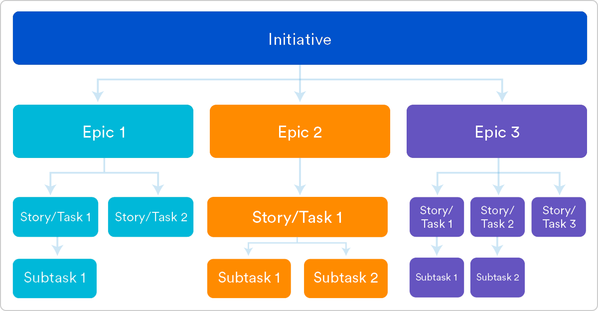
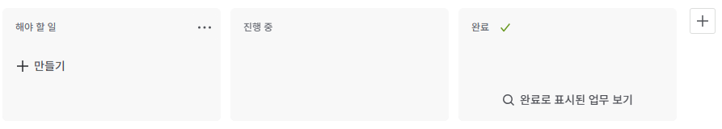

# Jira

Jira는 Atlassian에서 개발한 이슈·프로젝트 관리 플랫폼으로, 소프트웨어 개발 과정에서 발생하는 요구사항, 버그, 작업 흐름을 구조적이고 체계적으로 관리하기 위해 널리 사용되는 도구이다.
특히 애자일 개발(스크럼·칸반)을 지원하고, 개발자 중심으로 설계되어 Git·CI/CD 시스템과 유기적으로 연동되는 것이 특징이다.

개발 과정의 “작업 흐름 정의”, “협업”, “관리 자동화”에 중점을 둔 도구이기 때문에 현대 개발 팀의 표준처럼 자리 잡았다.

Jira의 구조적 특징은 다음 세 가지로 구성된다.

```text
이슈(Issue): 개발 과정에서 처리해야 할 모든 업무 단위
보드(Board): 작업 진행 상태를 시각화하는 화면 (Scrum/Kanban)
워크플로(Workflow): 이슈가 이동하는 단계의 흐름 정의
```

## 이슈(Issue)
Issue는 Jira의 핵심 요소로, “개발자가 처리해야 하는 실제 작업 단위”를 의미한다.
기능 개발, 버그 수정, 기술 부채 정리 등 모든 작업은 Issue로 관리된다.

하나의 이슈는 명확한 목적과 완료 조건을 가져야 한다.

이슈는 상태(Workflow)를 따라 이동하며 팀의 진행 상황을 나타낸다.

커밋, PR, 빌드 결과, QA 내역 등과 연동 가능하다.

주요 Issue 타입은 다음과 같다.



```
Epic: 큰 단위의 기능 또는 프로젝트
Story / Task: 실제 개발자가 처리하는 기능 단위
Sub-task: 더 작은 작업 단위
Bug: 오류 및 결함
```

Issue는 프로젝트 관리의 최소 단위이며 Jira의 중심이다.

## 보드(Board)

Board는 이슈들의 상태를 시각화하여 현재 프로젝트의 진행 흐름을 한눈에 볼 수 있게 제공하는 UI이다.

애자일 개발을 위한 Scrum과 Kanban 보드를 제공한다.

개발자와 팀은 보드를 통해 “현재 무엇을 하고 있는지” 쉽게 파악할 수 있다.

이슈는 보드 상에서 드래그하여 상태를 변경할 수 있다.

스크럼 보드에서는 스프린트 관리가 가능하고, 번다운 차트와 리포트 기능을 제공하여 진행 상황을 분석할 수 있다.
칸반 보드는 지속적 흐름(Continuous Flow)을 기반으로 작업 진행 제한(WIP Limit)을 설정할 수 있다.

## 워크플로(Workflow)

Workflow는 이슈가 어떤 단계를 거쳐 완료되는지 정의한 프로세스이다.

프로젝트마다 다른 개발 프로세스를 반영해 자유롭게 설계할 수 있다.

일반적인 흐름은 To Do → In Progress → Code Review → QA → Done과 같다.

자동화(Automation)와 연결하여 단계 전환을 자동으로 수행할 수 있다.

Workflow는 팀의 개발 문화와 규칙을 반영하며, 책임과 절차를 명확히 정의함으로써 협업 효율성을 높여준다.

## Jira의 장점

프로세스 자동화와 커밋·PR 연동을 통해 개발 효율이 매우 높다.

Issue 기반 관리로 작업을 명확히 추적하고 관리할 수 있다.

Agile(Scrum/Kanban) 팀을 위한 기능이 매우 잘 설계되어 있다.

CI/CD, GitHub/GitLab, Slack 등 다양한 도구와 유기적으로 통합된다.

대형 프로젝트에서도 안정적인 운영이 가능하며 확장성이 높다.

## Jira의 한계점

기능이 많아 초기 학습 비용이 높다.

작은 팀에서는 과도하게 복잡해질 수 있다.

워크플로가 지나치게 방대해지면 작업 속도가 느려질 수 있다.

커스터마이징이 너무 자유로워 관리자가 없으면 혼란스러워질 수 있다.

## Jira의 기본 흐름

Jira에 접속하여 상단에 네비게이션 바에서 우측 만들기 버튼을 눌려 프로젝트 생성


사용자는 새로운 작업을 Issue로 생성한다.


Issue는 Board 상에서 상태에 따라 이동된다.

개발자는 Git 브랜치/커밋/PR을 Issue 번호와 연결한다.

CI/CD 시스템이 자동으로 연동되어 빌드·테스트 결과가 Issue에 기록된다.

완료된 작업은 Done 상태로 이동하며 스프린트 또는 릴리즈에 포함된다.

이 구조를 통해 Jira는 개발 전 과정을 통합적으로 관리할 수 있게 해준다.

## Jira는 언제 사용하는가?

1. 팀이 애자일 방법론(스크럼/칸반)을 사용한다면
2. 여러 개발자와 협업하며 작업 단위 관리가 필요하다면
3. 커밋/PR/배포 내역과 업무를 한 곳에서 추적해야 한다면
4. QA, 기획자, 디자이너가 함께 사용하는 통합된 플랫폼이 필요하다면
5. 프로젝트 규모가 커지고 업무 상태 관리가 복잡해지기 시작했다면
6. Jira는 사실상 업계 표준으로 자리 잡은 도구이다.