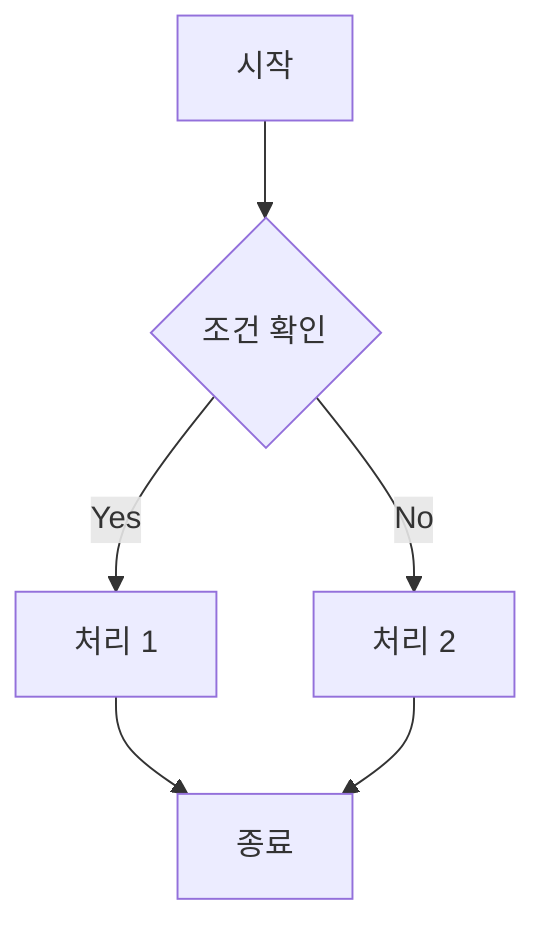
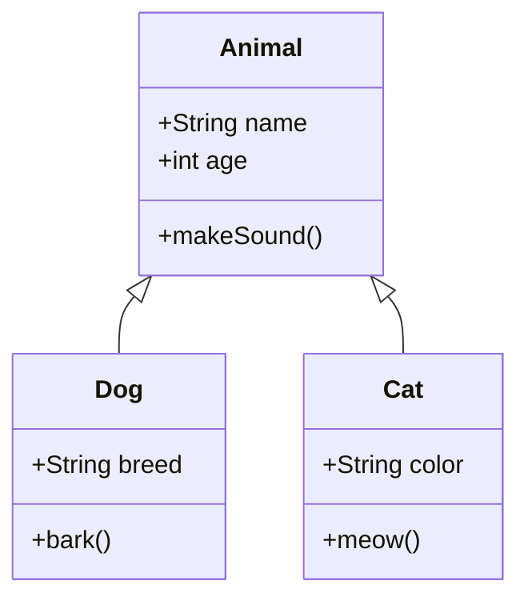
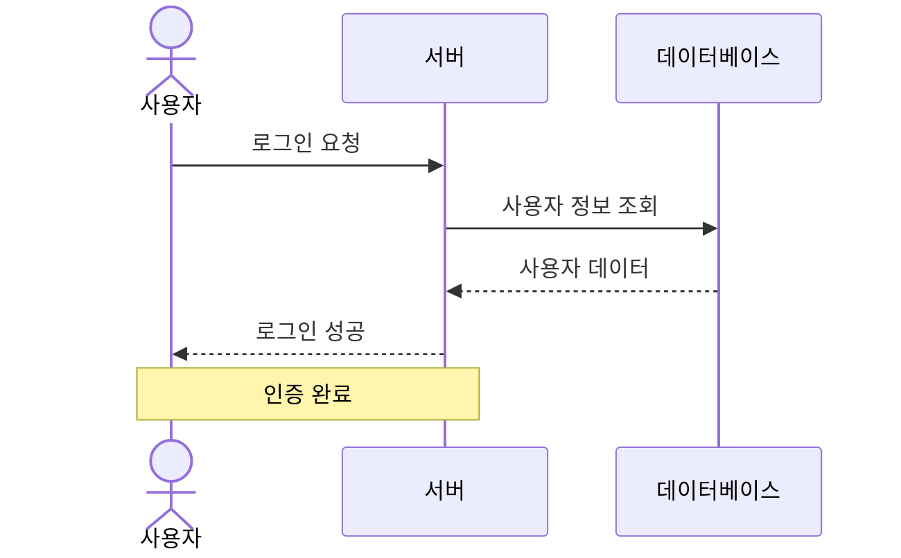
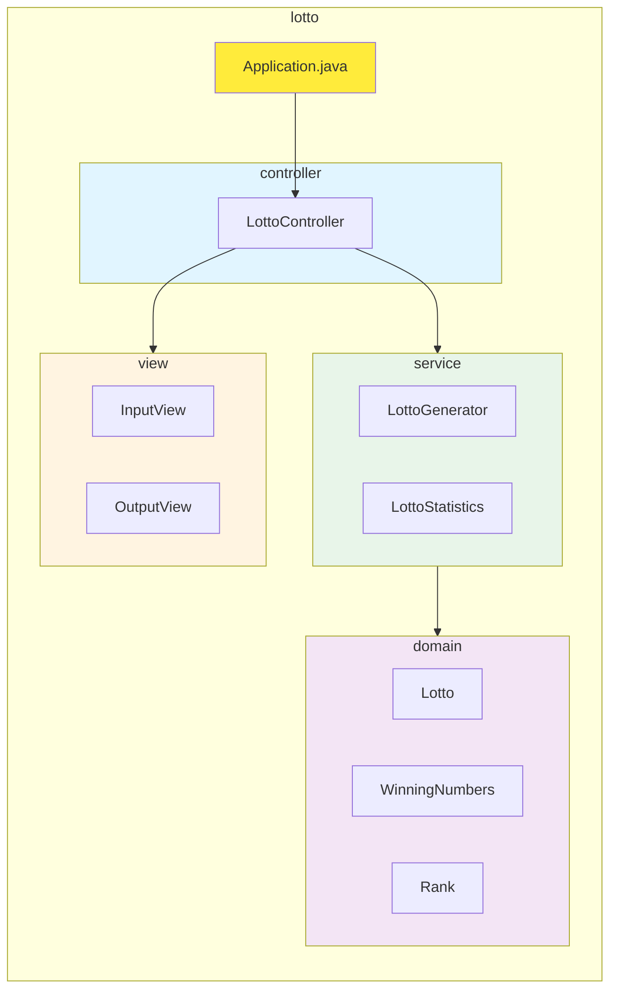
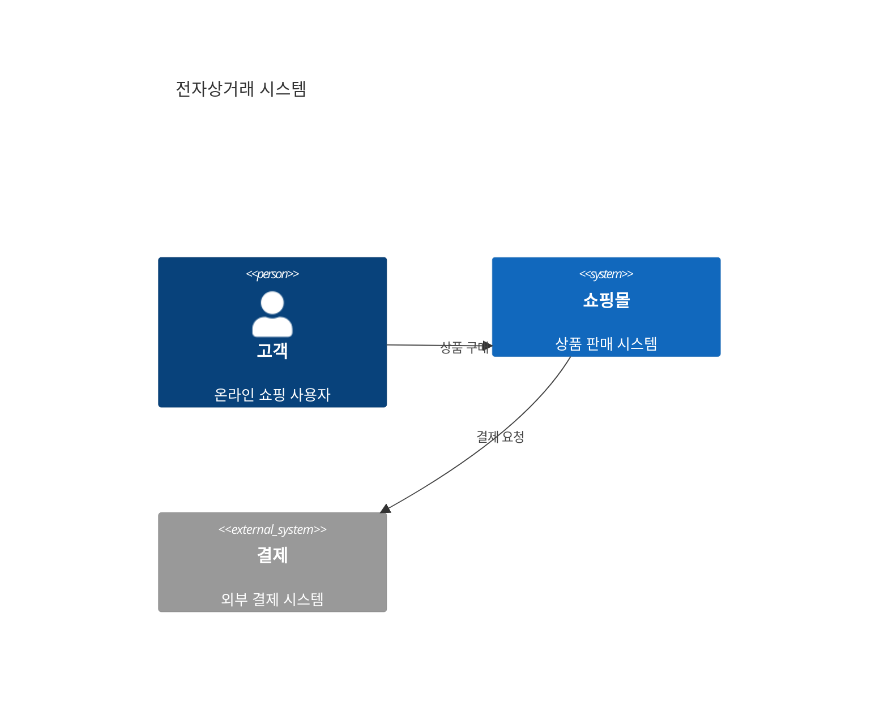
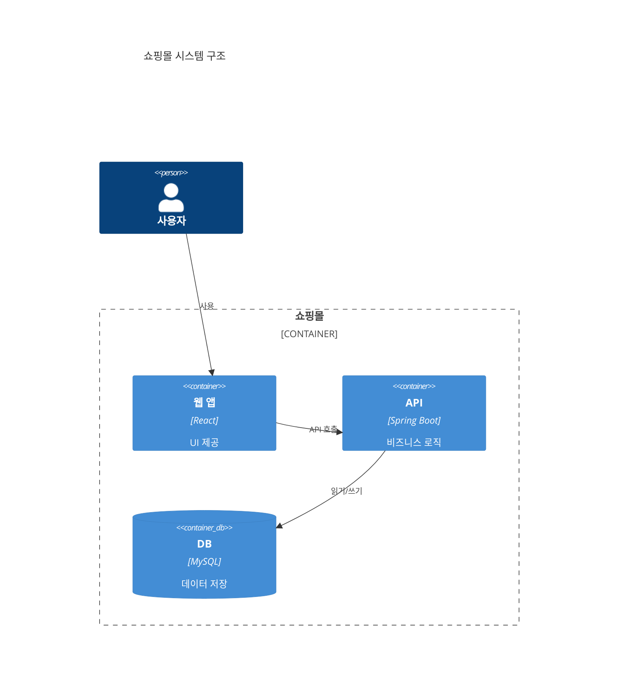
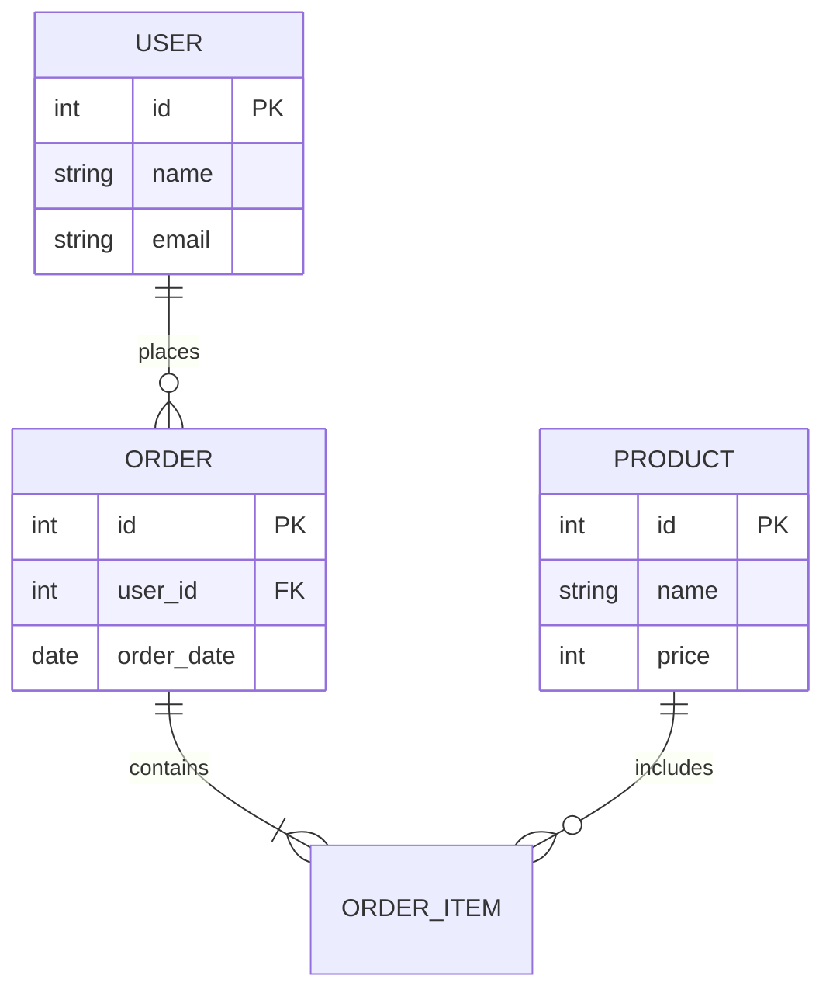

# Mermaid
Mermaid는 다이어그램을 작성할수 있게 해주는 마크다운 문법이다.

IntelliJ나 VSC에서는 확장을 깔아야 볼수 있으며, github에는 자동으로 적용된다.

## 링크
[mermaid Live editor](https://mermaid.live/edit)

## 다이어그램
ReadME에 다이어그램을 사용하면 좋은 이점은 다음과 같습니다.
1. 빠른 의사소통
    - 복잡한 시스템 구조가 한눈에 파악됨
    - 텍스트 설명보다 직관적임
    - 팀원간의 빠른 지식 공유가 가능함

2. 문서화의 효율성
    - 코드와 함께 버전 관리가 가능해짐
    - 그래픽 도구 없이 마크다운 문법만으로 작성 가능
    - Github에 자동으로 렌더링 되어 별도의 이미지 관리가 필요 없음

3. 유지보수 용이성
    - 시스템 변경 시 다이어그램도 쉽게 수정 가능함
    - 코드 리뷰 시 구조 변경을 명확히 확인할 수 있음

### 플로우 차트
프로세스의 흐름을 표현할 때 사용

#### 예시


#### 기본 문법
```markdown
flowchart TD
    A[시작] --> B{조건 확인}
    B -->|Yes| C[처리 1]
    B -->|No| D[처리 2]
    C --> E[종료]
    D --> E
```
```
[ ] : 사각형
( ) : 둥근 사각형
{ } : 다이아몬드
| | : 레이블

방향지정
    - TD, TB : 위에서 아래로 (Top Down, Top to Bottom)
    - LR : 왼쪽에서 오른쪽
    - RL : 오른쪽에서 왼쪽
    - BT : 아래서 위로
```

### 클래스 다이어그램
객체 지향 프로그래밍의 클래스 구조를 표현

#### 예시


#### 기본 문법
```markdown
classDiagram
    class Animal {
        +String name
        +int age
        +makeSound()
    }
    class Dog {
        +String breed
        +bark()
    }
    class Cat {
        +String color
        +meow()
    }
    
    Animal <|-- Dog
    Animal <|-- Cat
```

```
+: public 속성
-: private 속성
#: protected 속성
+method() : 함수

<|-- : 상속
*-- : 구성
o-- : 집합
--> 연관
```


### 시퀀스 다이어그램
객체 간 상호작용과 시간 순서를 표현
#### 예시

#### 기본 문법
```
sequenceDiagram
    actor U as 사용자
    participant S as 서버
    participant DB as 데이터베이스
    
    U->>S: 로그인 요청
    S->>DB: 사용자 정보 조회
    DB-->>S: 사용자 데이터
    S-->>U: 로그인 성공
    
    Note over U,S: 인증 완료
```

```
actor : User
participant : 사각형

->: 실선
-->: 점선
->>: 화살표 실선
-->>: 화살표 점선
->>+: 활성화
-->>-: 비활성화

Note over : 메모
```


### 패키지 다이어그램
패키지 구조와 의존성을 표현

#### Graph (서브그래프 활용)
프로젝트의 패키지 구조를 계층적으로 표현

##### 예시


##### 기본 문법
```markdown
graph LR
    subgraph 패키지명
        클래스1[ClassName]
        
        subgraph 하위패키지
            클래스2[SubClass]
        end
    end
    
    클래스1 --> 클래스2
    
    style 클래스1 fill:#색상코드
```
```
subgraph : 패키지/그룹 표현
style : 색상 스타일 지정
```

#### C4 다이어그램
시스템 아키텍처를 4가지 레벨로 표현 (Context, Container, Component, Code)

##### Level 1: Context (시스템 컨텍스트)


##### Level 2: Container (컨테이너)


##### 기본 문법
```markdown
C4Context / C4Container
    Person(id, "이름", "설명") : 사용자
    System(id, "이름", "설명") : 시스템
    System_Ext(id, "이름", "설명") : 외부 시스템
    
    Container(id, "이름", "기술", "설명") : 컨테이너
    ContainerDb(id, "이름", "기술", "설명") : 데이터베이스
    Container_Boundary(id, "레이블") { } : 경계선
    
    Rel(출발, 도착, "관계", "기술") : 관계
```
```
Context : 시스템과 외부의 관계
Container : 시스템 내부 구조
Component : 컨테이너 내부 구성요소
Code : 클래스 레벨 (classDiagram 사용)
```

#### ER 다이어그램
데이터베이스 엔티티와 관계를 표현

##### 예시


##### 기본 문법
```markdown
erDiagram
    ENTITY1 ||--o{ ENTITY2 : 관계명
    
    ENTITY1 {
        타입 속성명 제약조건
    }
```
```
관계 표현
    ||--|| : 일대일
    ||--o{ : 일대다
    }o--o{ : 다대다
    
제약조건
    PK : Primary Key
    FK : Foreign Key
    UK : Unique Key
```

### 다이어그램 선택 가이드
- **플로우차트**: 알고리즘, 프로세스 흐름
- **클래스 다이어그램**: 객체 구조, 상속 관계
- **시퀀스 다이어그램**: API 호출 과정, 객체 간 통신
- **패키지(Graph)**: 프로젝트 구조, 계층 아키텍처
- **C4**: 시스템 전체 아키텍처
- **ER**: 데이터베이스 설계