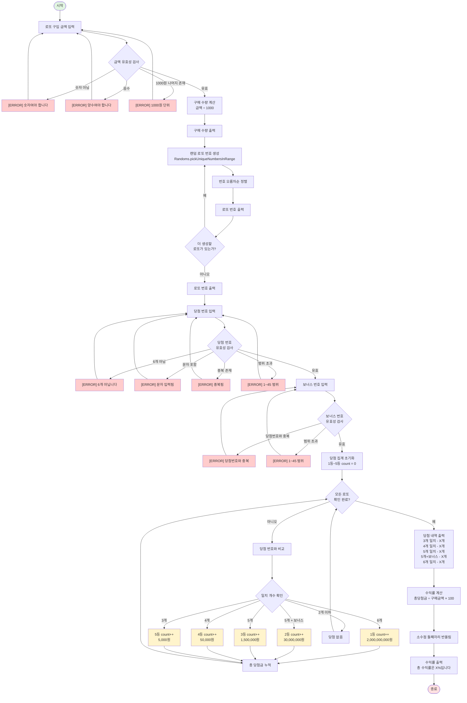
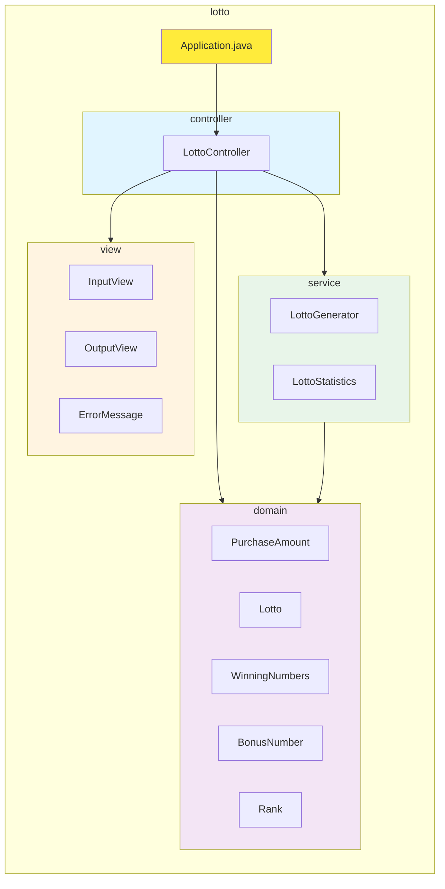
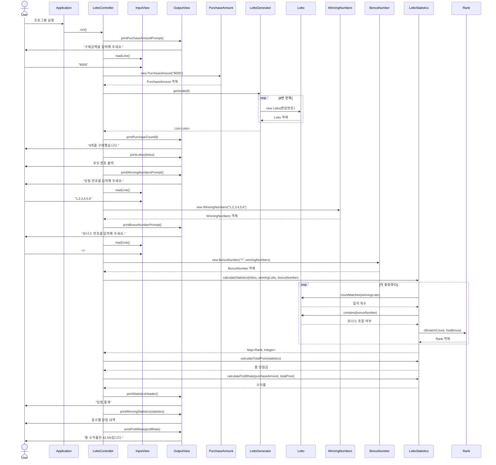

# 미션 간단 설명
사용자에게 금액을 입력 받고, 입력받은 금액만큼 무작위 숫자 6개를 가지는 숫자 배열을 생성하고, 사용자에서 우승 번호와 보너스 번호를 요청하여 총 몇 퍼센트 이득인지 반환하는 미션이다.

## 프로젝트 구조 변경
### 변경 이유
2주차 레이싱카 미션에서는 MVC 패턴을 사용했지만, 이번 로또 미션에서는 *DDD(Domain-Driven Design)* 관점으로 재구성했습니다.

기존에 사용하던 MVC 패턴의 경우 흐름제어의 역할을 하는 controller, 데이터와 비지니스가 혼재한 model, 입출력의 view를 사용합니다.
이는 model에 계산 로직과 검증 로직이 섞이며, 비지니스 규칙이 명확히 드러나지 않습니다.

그러한 이유로 순수히 비지니스 로직을 담당하는 domain, 도메인과 조합하는 응용 서비스인 service, 흐름 제어인 controller, 입출력인 view로 만들었습니다.

### 계층별 책임

|계층|책임|예시|
|--|--|--|
|Domain|비즈니스 규칙, 검증|"구매 금액은 1,000원 단위"|
|Service|도메인 조합, 외부 의존성|랜덤 로또 생성, 통계 계산|
|Controller|흐름 제어, 예외 처리|입력 → 생성 → 계산 → 출력|
|View|입출력|Console 읽기/쓰기|


## 프로젝트 구조
```text
src/main/java/lotto/
├── Application.java
├── domain/
│   ├── Lotto.java              # 로또 번호 (6개 숫자)
│   ├── PurchaseAmount.java     # 구매 금액 (검증 포함)
│   ├── WinningNumbers.java     # 당첨 번호 (검증 포함)
│   ├── BonusNumber.java        # 보너스 번호 (검증 포함)
│   └── Rank.java               # 당첨 등수 (열거형)
├── service/
│   ├── LottoGenerator.java     # 로또 생성 (랜덤)
│   └── LottoStatistics.java    # 통계 계산
├── view/
│   ├── InputView.java          # 입력
│   ├── OutputView.java         # 출력
│   └── ErrorMessage.java       # 에러 메시지
│   └── Message.java            # 메시지
└── controller/
    └── LottoController.java    # 게임 흐름 제어
```

### Rank 열거형으로 상수 관리
로또 등수는 1~5등으로 고정된 상수의 집합이기에 열거형을 통하여 관리하였습니다.

|장점|설명|
|--|--|
|타입 안정성|컴파일 타임에 잘못된 값 방지|
|가독성|Rank.FIRST > 1|
|응집도|등수별 속성(일치수, 상금)을 한 곳에 관리|
|확장성|새 등수 추가 시 한 곳만 수정|

#### 정적 팩토리 메서드 (of)
Rank 열거형을 만들며, 생성자 대신 정적 팩토리 메서드를 사용했습니다.
```java
public static Rank of(int matchCount, boolean matchBonus)
{
    
}
```
사용한 이유로는 생성자는 반환 타입 고정이기에 제가 원하는 방식으로 사용할 수 없었고, 찾아보니 정적 팩토리 메서드란 것이 있어 사용해 보았습니다.

|생성자|정적 팩토리 메서드 (of)|
|---|---|
|이름이 없음|이름으로 의도 표현|
|매번 새 객체 생성|캐싱 가능|
|반환 타입 고정|하위 타입 반환 가능|


## 핵심 기능
1. 구매 금액 검증
- 1,000원 단위 검증
- 양수 검증
- 숫자 형식 검증

2. 로또 번호 검증
- 6개 숫자 검증
- 1~45 범위 검증
- 중복 검증

3. 보너스 번호 검증
- 1~45 범위 검증
- 당첨 번호와 중복 검증

4. 당첨 통계
- 일치 개수 계산
- 보너스 번호 확인
- 등수 판별 (Rank.of)

5. 수익률 계산
- 총 당첨금 / 구매 금액 × 100
- 소수점 둘째 자리에서 반올림

## 아키텍처 다이어그램
### 플로우 차트

### 패키지 다이어그램


## 시퀀스 다이어그램


## 테스트 전략
| 테스트 종류        | 대상 | 개수|
|---------------|-----|-----|
| Domain 단위 테스트 |Lotto, PurchaseAmount, etc.|60+|
|통합 테스트|ApplicationTest|14|


## 요구사함
### 기능 요구사항

- [X] 입력
> 지역 변수로 입력받은 번호를 가지고 있다.
- [X] 로또 구입 금액을 입력 받는다.
> 만일 1000원으로 나누었을시 나머지가 있다면, 에러 처리한다.

- [X] 당첨 번호를 입력 받는다.
> 번호는 ','를 기준으로 구분한다.
> 번호는 6자리이다.
> 번호는 중복되어서는 안된다.
> 번호는 1~45 사이의 숫자이다.

- [X] 보너스 번호를 입력 받는다.
> 당첨 번호와 중복되어서는 않된다.
> 번호는 1~45 사이의 숫자이다.

- [X] 출력
    - [X] 발행한 로또 수량을 출력한다.
  > {갯수}개 구매했습니다.
    - [X] 로또 번호를 출력한다.
  > [{{갯수}}, {갯수}, {갯수}, {갯수}, {갯수}, {갯수}]
    - [X] 당첨 내역을 출력한다.
  ```terminaloutput
    3개 일치 (5,000원) - {갯수}개
    4개 일치 (50,000원) - {갯수}개
    5개 일치 (1,500,000원) - {갯수}개
    5개 일치, 보너스 볼 일치 (30,000,000원) - {갯수}개
    6개 일치 (2,000,000,000원) - {갯수}개 
  ```
    - [X] 수익률을 출력한다.
  > 총 수익률은 {퍼센트}%입니다.
    - [X] 예외 상황 시 에러 문구를 출력해야 한다. "[ERROR]"로 시작해야 한다.

- [X] 랜덤 함수
    - Randoms.pickUniqueNumbersInRange(1, 45, 6)을 통해 중복되지 않는 6개의 숫자 생성

- [X] 에러 처리
    - [X] 입력이 빈 문자열인 경우
  > [ERROR] 빈 문자열이 입력 되었습니다. 다시 입력해 주십시오
    - [X] 입력이 천원 단위가 아닐 경우
  > [ERROR] 입력은 천원 단위여야 합니다. 다시 입력해 주십시오
    - [X] 로또 구입 금액이 숫자가 아닐 시
  > [ERROR] 입력한 금액은 숫자여야 합니다. 다시 입력해 주십시오
    - [X] 로또 구입 금액이 음수일 경우
  > [ERROR] 입력한 금액은 양수여야 합니다. 다시 입력해 주십시오
    - [X] 구분자로 분리한 숫자가 6개가 아닌 경우
  > [ERROR] 입력 받은 숫자가 6개가 아닙니다. 다시 입력해 주십시오
    - [X] 구분자로 분리한 숫자가 문자일 경우
  > [ERROR] 숫자 입력이 아닌 문자가 입력되었습니다. 다시 입력해 주십시오
    - [X] 입력한 번호가 중복되는 경우
  > [ERROR] 입력받은 숫자가 중복되었습니다. 다시 입력해 주십시오
  > [ERROR] 입력한 보너스 번호는 중복되었습니다. 다시 입력해 주십시오
    - [X] 번호가 1~45의 범위를 초과하는 경우
  > [ERROR] 로또 번호는 1에서 45사이의 숫자를 입력해야 합니다. 다시 입력해 주십시오

> 사용자가 잘못된 값을 입력할 경우 IllegalArgumentException을 발생시킨 후 "[ERROR]"로 시작하는 에러 메시지를 출력 후 그 부분부터 입력을 다시 받는다.
> Exception이 아닌 IllegalArgumentException, IllegalStateException 등과 같은 명확한 유형을 처리한다.

- [X] 로또 함수
    - [X] 숫자열을 오름차순으로 정렬한다.
    - [X] 지역 변수 numbers가 6개의 숫자를 가진지 검증한다.
    - [X] 입력받은 로또 객체와 비교하여 등수를 반환한다.

- [X] 가챠 함수
> 지역 변수로는 구매한 금액, 당첨 count, 총 당첨금을 가지고 있다.
- [X] 전달 받은 값을 1000으로 나눈 몫을 반환한다.
- [X] 랜덤함수로 받은 값을 로또 클래스의 전달인자로 사용하여 객체를 생성한다.
- [X] 당첨 기준을 토대로 당첨 count를 증가 시킨다.
  ```terminaloutput
    1등: 6개 번호 일치 / 2,000,000,000원
    2등: 5개 번호 + 보너스 번호 일치 / 30,000,000원
    3등: 5개 번호 일치 / 1,500,000원
    4등: 4개 번호 일치 / 50,000원
    5등: 3개 번호 일치 / 5,000원
  ```
- [X] 수익률을 소수점 둘째 자리부터 반올림한다.


#### 입출력 요구사항
##### 입력
- 로또 구입 금액을 입력 받는다. 구입 금액은 1,000원 단위로 입력 받으며 1,000원으로 나누어 떨어지지 않는 경우 예외 처리한다.
> 14000

- 당첨 번호를 입력 받는다. 번호는 쉼표(,)를 기준으로 구분한다.
> 1,2,3,4,5,6

- 보너스 번호를 입력 받는다.
> 7

##### 출력
- 발행한 로또 수량 및 번호를 출력한다. 로또 번호는 오름차순으로 정렬하여 보여준다.
```terminaloutput
8개를 구매했습니다.
[8, 21, 23, 41, 42, 43] 
[3, 5, 11, 16, 32, 38] 
[7, 11, 16, 35, 36, 44] 
[1, 8, 11, 31, 41, 42] 
[13, 14, 16, 38, 42, 45] 
[7, 11, 30, 40, 42, 43] 
[2, 13, 22, 32, 38, 45] 
[1, 3, 5, 14, 22, 45]
```

- 당첨 내역을 출력한다.
```terminaloutput
3개 일치 (5,000원) - 1개
4개 일치 (50,000원) - 0개
5개 일치 (1,500,000원) - 0개
5개 일치, 보너스 볼 일치 (30,000,000원) - 0개
6개 일치 (2,000,000,000원) - 0개
```

- 수익률은 소수점 둘째 자리에서 반올림한다. (ex. 100.0%, 51.5%, 1,000,000.0%)
```terminaloutput
총 수익률은 62.5%입니다.
```

- 예외 상황 시 에러 문구를 출력해야 한다. 단, 에러 문구는 "[ERROR]"로 시작해야 한다.
> [ERROR] 로또 번호는 1부터 45 사이의 숫자여야 합니다.


#### 실행 결과 예시
```terminaloutput
구입금액을 입력해 주세요.
8000

8개를 구매했습니다.
[8, 21, 23, 41, 42, 43] 
[3, 5, 11, 16, 32, 38] 
[7, 11, 16, 35, 36, 44] 
[1, 8, 11, 31, 41, 42] 
[13, 14, 16, 38, 42, 45] 
[7, 11, 30, 40, 42, 43] 
[2, 13, 22, 32, 38, 45] 
[1, 3, 5, 14, 22, 45]

당첨 번호를 입력해 주세요.
1,2,3,4,5,6

보너스 번호를 입력해 주세요.
7

당첨 통계
---
3개 일치 (5,000원) - 1개
4개 일치 (50,000원) - 0개
5개 일치 (1,500,000원) - 0개
5개 일치, 보너스 볼 일치 (30,000,000원) - 0개
6개 일치 (2,000,000,000원) - 0개
총 수익률은 62.5%입니다.