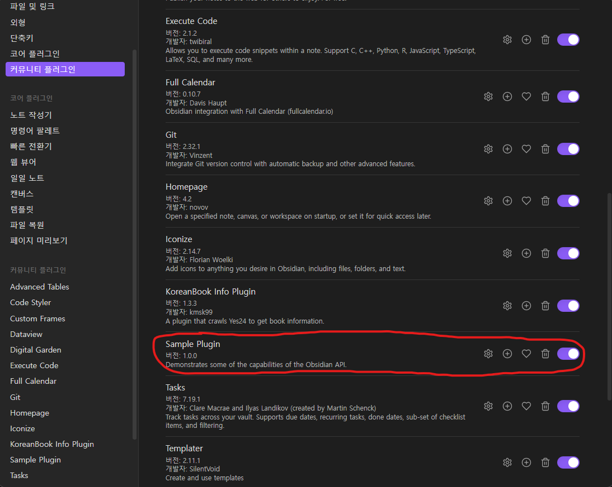

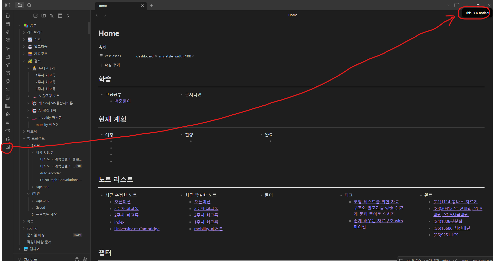

UI/UX
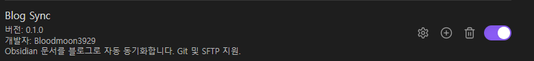

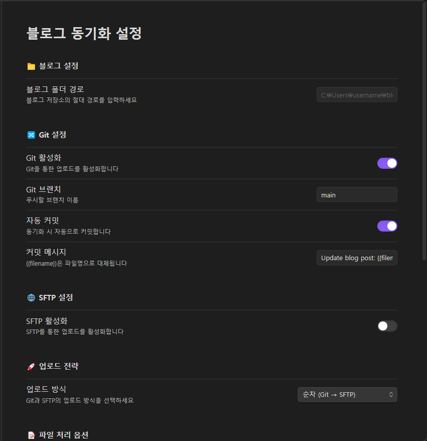

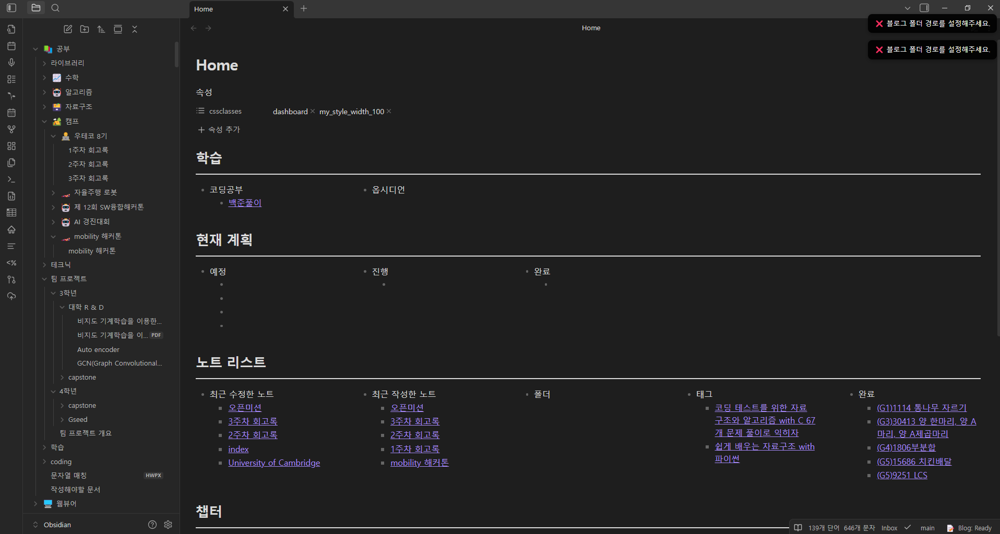

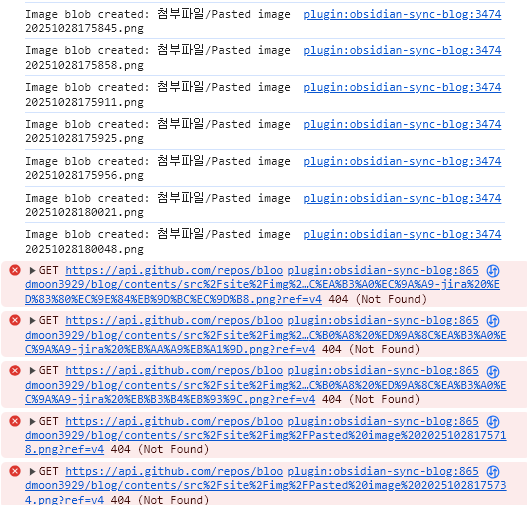

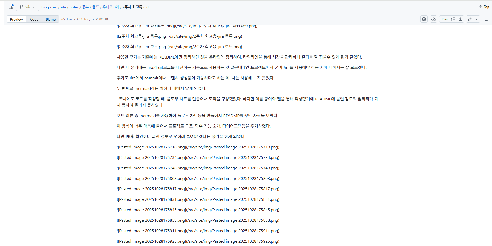

하드웨어

플러그인

octokit

블로그

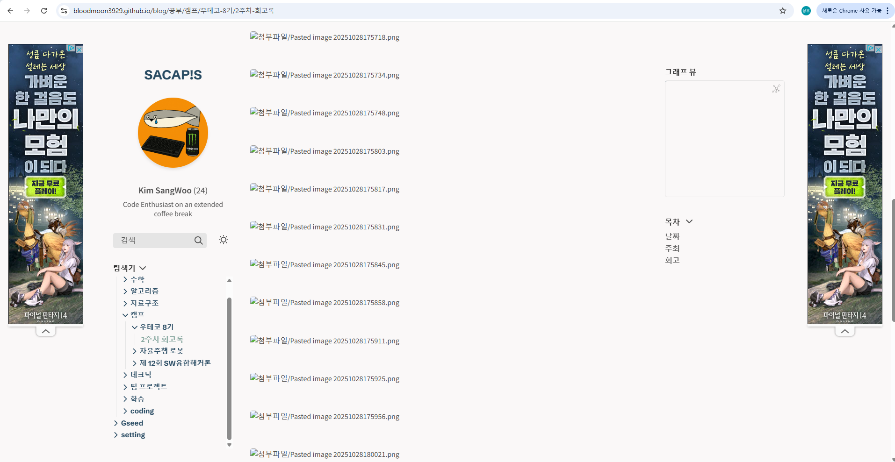

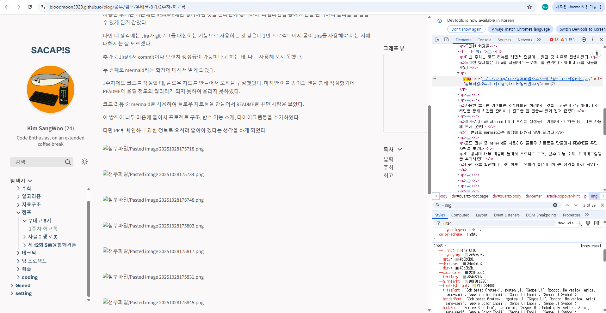

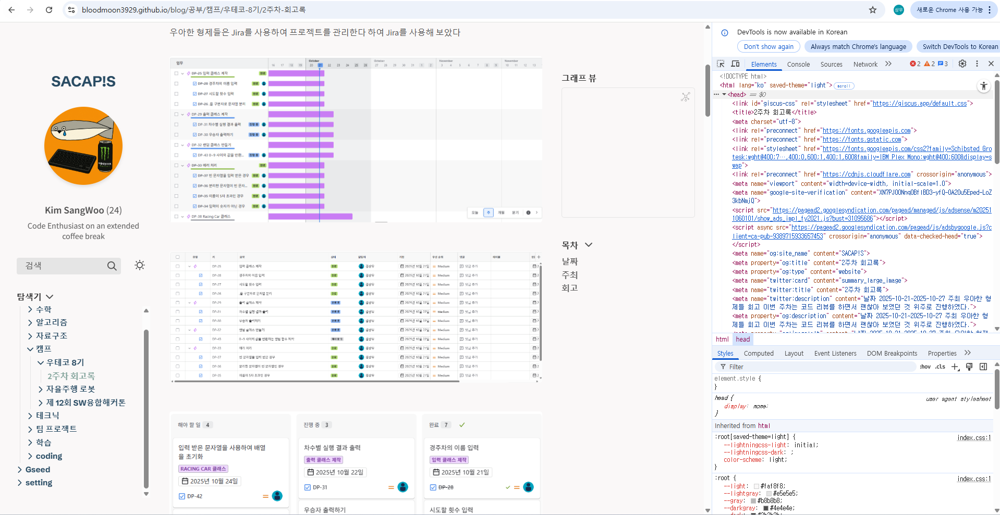

정리
1. 옵시디언 sync (진행 중)
    - octokit이 무엇인가
    - https://github.com/obsidianmd/obsidian-sample-plugin
    - typescipt
    - 파일 구조

2. github 액션을 통한 깃블로그 (완성 - )
    - Quartz v4가 무엇인가
    - Quartz v4 사용법
    - .github 파일을 통한 Action 자동화
    - src 파일구조
    - google ADs
    - google search engine
    - quartz.layout을 통한 블로그 구성
    - quartz.config.ts를 통한 설정
        - 한국어 변경
    - robots.txt
    - 플러그인
        - 댓글창(giscus)
        - 그래프 뷰
        - sitemap 자동 생성

3. 개인 나스를 통한 블로그 호스팅
    - 하드웨어 구축
    - Openmediavault가 무엇인지
    - nextcloud를 통한 파일시스템 구축
    - 옵시디언 확장으로 제어

 
 
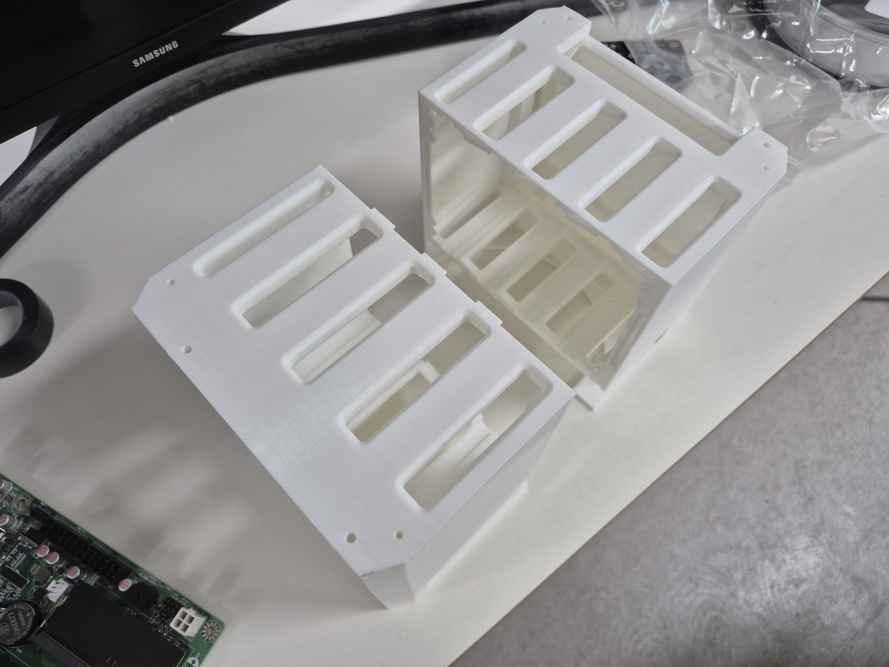 
 
 
 
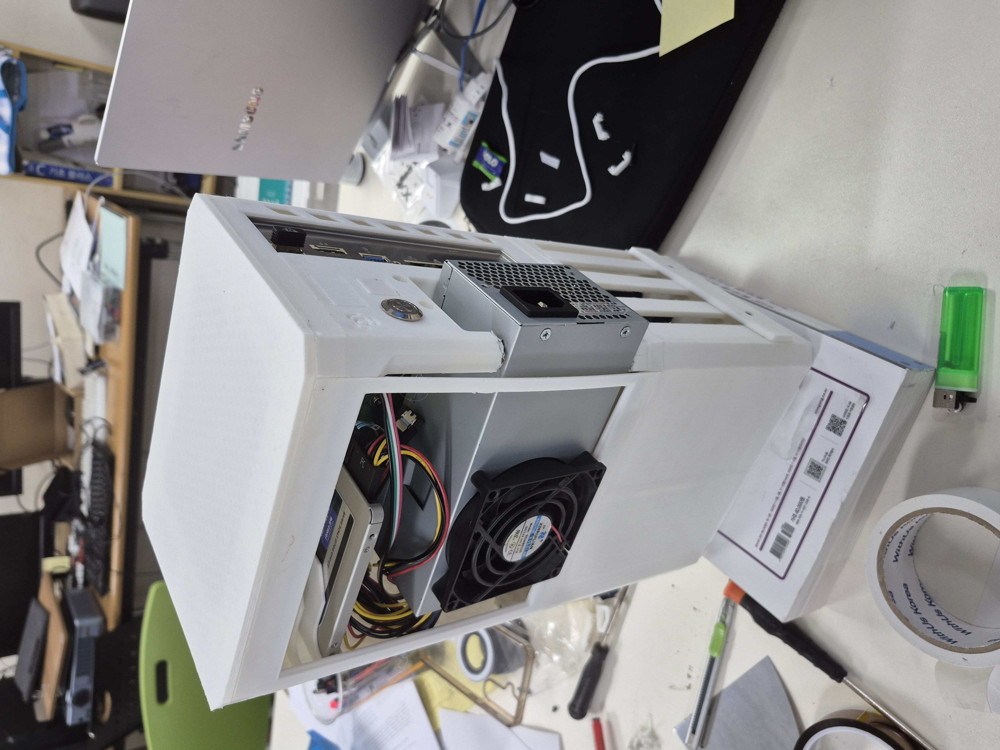 
 
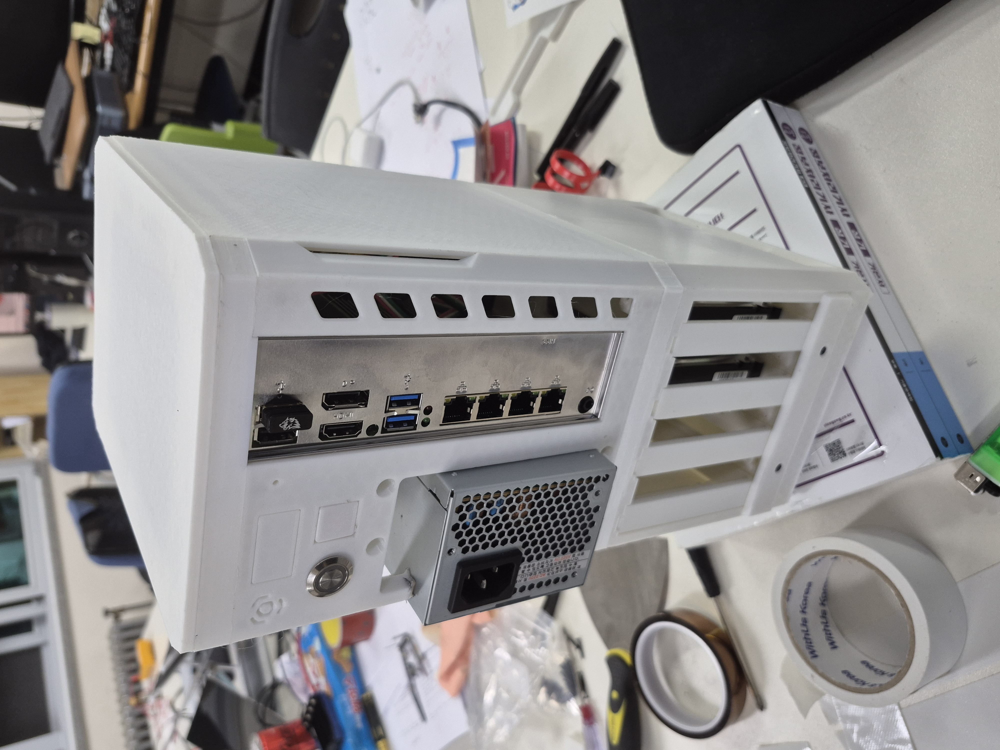

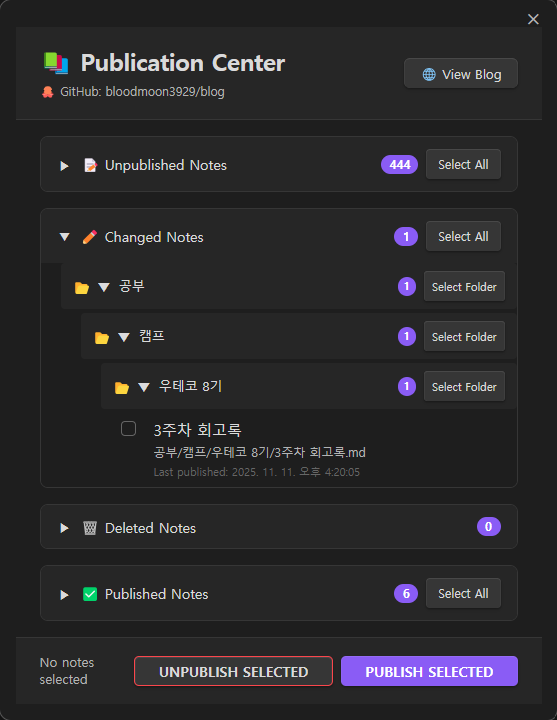