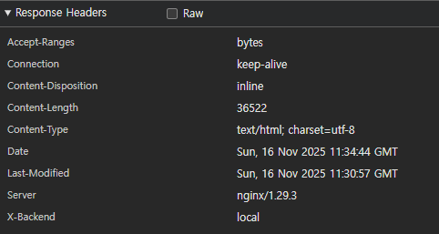
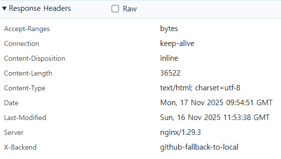
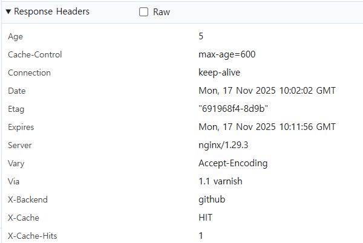

UI/UX


하드웨어


플러그인

octokit


블로그


정리











문제점
삭제된 레포가 계속 남아있는 문제,(delete에는 현재 깃허브 서버에 올라와 있는 레포들의 목록이 올라와 있어야 함)

로컬서버에서의 삭제 기능 구현이 안되어 있음

webhook 타임 아웃됨

깃허브로 접속할때, index 페이지를 제외하고 접속할 수 없는 문제

quartz 블로그 세팅법 알려줘야함

깃허브 액션 사용 방법 알려줘야함

추가되어야 하는 파일들 안내 해줘야 함

깃토큰 생성방법 안내해줘야함

```
Failed to load resource: the server responded with a status of 403 ()Understand this error ads?client=ca-pub-9389715933657453&output=html&adk=1812271804&adf=3025194257&lmt=1763441514&plat=3%…:1 Failed to load resource: the server responded with a status of 403 ()Understand this error giscus.app/api/discussions?repo=bloodmoon3929%2Fblog&term=index&category=General&number=0&strict=false&last=15:1 Failed to load resource: the server responded with a status of 404 ()Understand this error giscus.app/api/discussions?repo=bloodmoon3929%2Fblog&term=index&category=General&number=0&strict=false&first=15:1 Failed to load resource: the server responded with a status of 404 ()Understand this error postscript.js:1093 GET http://bloodmoon3929.duckdns.org:8081/%EA%B3%B5%EB%B6%80/%EC%95%8C%EA%B3%A0%EB%A6%AC%EC%A6%98/LCS(Longest-common-subsequence;-%EC%B5%9C%EC%9E%A5-%EA%B3%B5%ED%86%B5-%EB%B6%80%EB%B6%84-%EC%88%98%EC%97%B4)/ net::ERR_CONNECTION_TIMED_OUT Di @ postscript.js:1093 m @ postscript.js:1093Understand this error postscript.js:1093 TypeError: Failed to fetch at Di (postscript.js:1093:134674) at HTMLAnchorElement.m (postscript.js:1093:135335) (anonymous) @ postscript.js:1093Understand this error 2client.js:7 [giscus] Discussion not found. A new discussion will be created if a comment/reaction is submitted. (anonymous) @ client.js:7Understand this warning postscript.js:1093 GET http://bloodmoon3929.duckdns.org:8081/%EA%B3%B5%EB%B6%80/%EC%95%8C%EA%B3%A0%EB%A6%AC%EC%A6%98/LCS(Longest-common-subsequence;-%EC%B5%9C%EC%9E%A5-%EA%B3%B5%ED%86%B5-%EB%B6%80%EB%B6%84-%EC%88%98%EC%97%B4)/ net::ERR_CONNECTION_TIMED_OUT Di @ postscript.js:1093 m @ postscript.js:1093Understand this error postscript.js:1093 TypeError: Failed to fetch at Di (postscript.js:1093:134674) at HTMLAnchorElement.m (postscript.js:1093:135335) (anonymous) @ postscript.js:1093Understand this error postscript.js:1093 GET http://bloodmoon3929.duckdns.org:8081/%EA%B3%B5%EB%B6%80/%EC%95%8C%EA%B3%A0%EB%A6%AC%EC%A6%98/%EB%8F%99%EC%A0%81-%EA%B3%84%ED%9A%8D%EB%B2%95/ net::ERR_CONNECTION_TIMED_OUT Di @ postscript.js:1093 m @ postscript.js:1093Understand this error postscript.js:1093 TypeError: Failed to fetch at Di (postscript.js:1093:134674) at HTMLAnchorElement.m (postscript.js:1093:135335) (anonymous) @ postscript.js:1093Understand this error postscript.js:1093 GET http://bloodmoon3929.duckdns.org:8081/%EA%B3%B5%EB%B6%80/%EC%95%8C%EA%B3%A0%EB%A6%AC%EC%A6%98/LCS(Longest-common-subsequence;-%EC%B5%9C%EC%9E%A5-%EA%B3%B5%ED%86%B5-%EB%B6%80%EB%B6%84-%EC%88%98%EC%97%B4)/ net::ERR_CONNECTION_TIMED_OUT Di @ postscript.js:1093 m @ postscript.js:1093Understand this error postscript.js:1093 TypeError: Failed to fetch at Di (postscript.js:1093:134674) at HTMLAnchorElement.m (postscript.js:1093:135335) (anonymous) @ postscript.js:1093Understand this error postscript.js:1093 GET http://bloodmoon3929.duckdns.org:8081/%EA%B3%B5%EB%B6%80/%EC%95%8C%EA%B3%A0%EB%A6%AC%EC%A6%98/%EB%A9%94%EB%AA%A8%EC%9D%B4%EC%A0%9C%EC%9D%B4%EC%85%98/ net::ERR_CONNECTION_TIMED_OUT Di @ postscript.js:1093 m @ postscript.js:1093Understand this error postscript.js:1093 TypeError: Failed to fetch at Di (postscript.js:1093:134674) at HTMLAnchorElement.m (postscript.js:1093:135335) (anonymous) @ postscript.js:1093Understand this error postscript.js:1093 GET http://bloodmoon3929.duckdns.org:8081/%EA%B3%B5%EB%B6%80/%EC%95%8C%EA%B3%A0%EB%A6%AC%EC%A6%98/%EB%B0%B1%ED%8A%B8%EB%9E%98%ED%82%B9/ net::ERR_CONNECTION_TIMED_OUT Di @ postscript.js:1093 m @ postscript.js:1093Understand this error postscript.js:1093 TypeError: Failed to fetch at Di (postscript.js:1093:134674) at HTMLAnchorElement.m (postscript.js:1093:135335) (anonymous) @ postscript.js:1093Understand this error postscript.js:1093 GET http://bloodmoon3929.duckdns.org:8081/%EA%B3%B5%EB%B6%80/%EC%95%8C%EA%B3%A0%EB%A6%AC%EC%A6%98/%EC%A0%95%EB%A0%AC/%EB%B6%84%ED%95%A0%EC%A0%95%EB%B3%B5/%ED%80%B5-%EC%A0%95%EB%A0%AC/ net::ERR_CONNECTION_TIMED_OUT Di @ postscript.js:1093 m @ postscript.js:1093Understand this error postscript.js:1093 TypeError: Failed to fetch at Di (postscript.js:1093:134674) at HTMLAnchorElement.m (postscript.js:1093:135335) (anonymous) @ postscript.js:1093Understand this error postscript.js:1093 GET http://bloodmoon3929.duckdns.org:8081/%EA%B3%B5%EB%B6%80/%EC%95%8C%EA%B3%A0%EB%A6%AC%EC%A6%98/%EC%A0%95%EB%A0%AC/%EC%9D%B4%EC%A7%84-%EA%B2%80%EC%83%89/ net::ERR_CONNECTION_TIMED_OUT Di @ postscript.js:1093 m @ postscript.js:1093Understand this error postscript.js:1093 TypeError: Failed to fetch at Di (postscript.js:1093:134674) at HTMLAnchorElement.m (postscript.js:1093:135335)
```