# 오픈미션: Obsidian 블로그 자동 발행 시스템
**"오프라인 메모앱을 웹 블로그로 - 개발자를 위한 완전 자동화 퍼블리싱 플랫폼"**

## 미션 선정
옵시디언(Obsidian)은 마크다운 기반의 개발자 친화적 메모 앱입니다. 노션(Notion)과 달리 **완전한 오프라인 환경**에서 작동하지만, 이는 동시에 자료 공유의 어려움이라는 단점을 가져옵니다.

많은 개발자들이 이 문제를 해결하기 위해 Obsidian의 마크다운 파일을 Quartz, Jekyll, Hugo 같은 정적 사이트 생성기로 변환하여 블로그를 운영합니다. 하지만 이 과정은:

- ❌ Git 명령어를 매번 수동으로 입력해야 함
- ❌ 이미지 경로 변환을 수작업으로 처리
- ❌ 빌드 및 배포 과정을 별도로 관리
- ❌ 비개발자에게는 진입장벽이 높음

**본 프로젝트는 이러한 모든 과정을 원클릭으로 자동화하는 Obsidian 플러그인을 개발하는 것을 목표로 합니다.**


## 왜 TypeScript를 선택했나?

### 낯설지만, 적용 가능한 언어
TypeScript는 사용해본적 없었으나, **Obsidian 플러그인 생태계가 TypeScript 기반**이기에 선택할 수밖에 없었습니다.
 그 외에도 선정한 이유가 있는데,

- **정적 타입 시스템**: Java와 유사하게 컴파일 타임에 오류 검출
- **비동기 처리**: GitHub API, Webhook 등 네트워크 요청 처리에 적합
- **생태계**: Obsidian API, Octokit, esbuild 등 검증된 도구들
- **학습 가치**: 프론트엔드 생태계 경험을 통한 풀스택 역량 확장

**2주 안에 TypeScript를 배우면서 개발한다**는 것이 처음엔 불가능해 보였지만, 객체지향 경험 덕분에 생각보다 빠르게 적응할 수 있었습니다.

---

## 왜 Quartz를 선택했나?

### 선정 기준

정적 사이트 생성기는 Jekyll, Hugo, Gatsby, Next.js 등 선택지가 많습니다. **2주라는 시간 제약** 속에서 Quartz를 선택한 이유는:

**1. Obsidian 네이티브 지원**
- `![[wikilink]]` 문법을 그대로 지원
- 백링크(Backlinks) 자동 생성
- 그래프 뷰 내장
→ **별도 변환 로직 불필요**

**2. TypeScript 기반**
- 플러그인과 동일한 언어로 커스터마이징 가능
- 빌드 시스템(esbuild) 이해 용이
→ **학습 곡선 감소**

**3. 빠른 빌드 속도**
- Hugo만큼 빠른 빌드 (수백 개 파일도 1초 이내)
- 개발 서버 핫 리로드
→ **빠른 피드백 루프**

**4. 현대적인 디자인**
- 다크 모드 기본 지원
- 반응형 레이아웃
- 검색 기능 내장
→ **추가 작업 최소화**

---

## 개선 효과: 기존 워크플로우 vs 자동화 시스템

| 작업 | 기존 방식 | 본 프로젝트 | 개선 효과 |
|------|----------|------------|----------|
| **파일 발행** | 1. Git clone<br>2. 파일 복사<br>3. git add/commit/push<br>4. 이미지 경로 수정 | Publication Center에서<br>클릭 1회 | **20단계 → 1단계**<br>(95% 시간 단축) |
| **이미지 처리** | 1. 이미지 파일 찾기<br>2. 경로 수동 수정<br>3. 별도 업로드 | 자동 추출 및 변환 | **실수 제로화** |
| **배포 속도** | GitHub Actions만 사용<br>(3~5분 소요) | 로컬 서버 즉시 반영<br>(10초 이내) | **30배 빠름** |
| **가용성** | GitHub Pages 단일 의존 | GitHub + 로컬 서버<br>자동 폴백 | **99.9% 가용성** |

## 기술 스택

### Core Infrastructure
- **Server OS**: OpenMediaVault 7
- **Container**: Docker + Docker Compose
- **Web Server**: Nginx (Load Balancer)
- **SSL**: Let's Encrypt + Certbot (자동 갱신)

### Blog Platform
- **Static Site Generator**: Quartz 4 (TypeScript)
- **Hosting**: GitHub Pages + OMV Local Server
- **CDN/DNS**: Cloudflare (Workers + Tunnel)
- **CI/CD**: GitHub Actions

### Plugin Development
- **Language**: TypeScript 4.7
- **Build System**: esbuild
- **GitHub API**: Octokit REST
- **UI Framework**: Obsidian Plugin API

### Development Tools
- **IDE**: Visual Studio Code + CLion
- **Version Control**: Git/GitHub
- **Asset Management**: SMB File Sharing
- **Monitoring**: Nginx Access Logs + Cloudflare Analytics

## 개발 성과

### 핵심 성과: 플랫폼 독립적 아키텍처

이 프로젝트의 가장 큰 성과는 **Publisher 계층의 완전한 분리**입니다.

각 Publisher는 독립적으로 동작하며, 새로운 배포 대상(예: S3, FTP)을 추가하려면 인터페이스만 구현하면 됩니다.

이는 단순히 코드를 모듈화했다는 기술적 성취를 넘어, Clean Architecture가 실제로 유지보수 시간을 절약한다는 것을 몸소 체험한 경험이었습니다.

### 2주 동안 배운 것들

✅ **TypeScript 실전 개발**
   - async/await, Promise 체이닝
   - 타입 안전성과 인터페이스 설계
   - esbuild 빌드 시스템
   
✅ **Docker & 네트워킹**
   - 컨테이너 오케스트레이션
   - 포트 포워딩, 프록시 설정
   - socat을 이용한 네트워크 브리징
   
✅ **Git 내부 동작**
   - blob, tree, commit 구조
   - Tree API를 통한 원자적 커밋
   - ref 업데이트 메커니즘
   
✅ **로드 밸런싱**
   - 세션 고정 (IP Hash)
   - 헬스 체크 및 폴백 전략
   - Cloudflare Workers Edge Computing
   
✅ **SSL/TLS**
   - Let's Encrypt 인증서 발급
   - Certbot 자동 갱신 (cron)
   - HTTPS 강제 리다이렉트


## 프로젝트 아키텍쳐
### 전체 시스템 구조
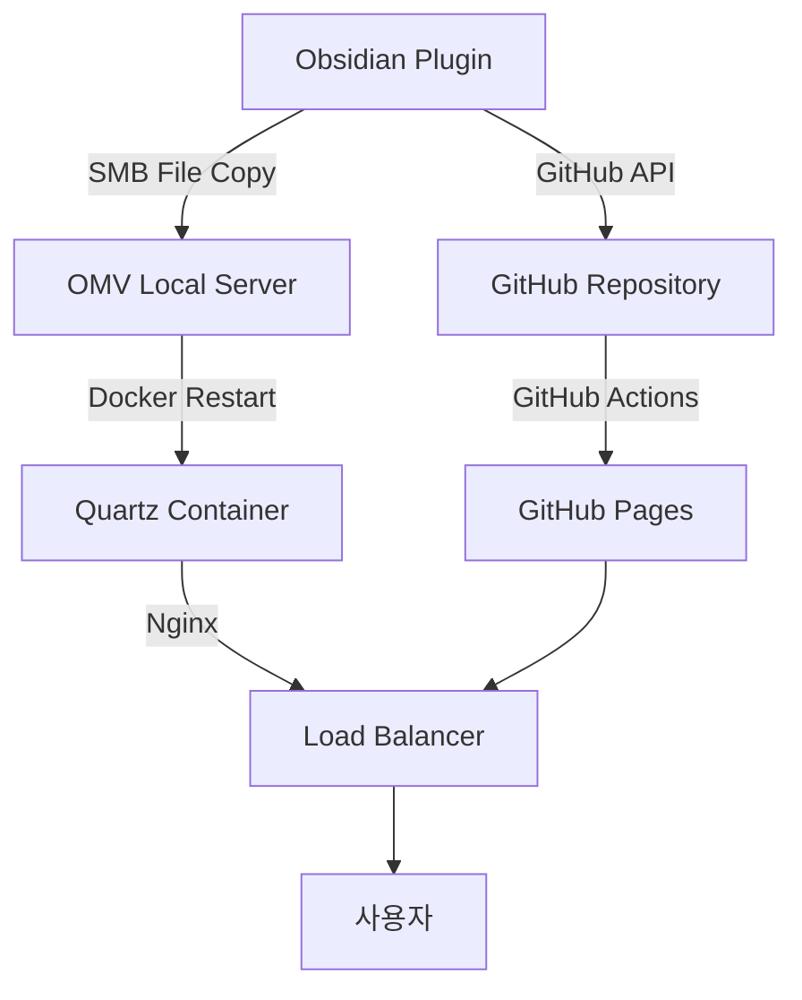

### 이중 배포 전략
- **GitHub Pages**: 안정적인 글로벌 접근성
- **OMV 로컬 서버**: 빠른 업데이트 및 제어
- **nginx load balancer**: 로드 밸런싱으로 가용성 보장

## 요구사항
### 하드웨어
#### 사용 기술
OpenMediaVault, nextcloud, Docker

#### 내용
[OpenMediaVault 및 nextcloud](./OpenMediaVault.md)

- 사용 보드
 
- **CPU** : intel 프로세서 N150 (4코어 4 스레드)
- **Ram** : DDR5 16GB
- **저장 공간** : 시게이트 HHD 4TB * 2 + 삼성 ssd 500GB + M.2 128GB


- 조립 과정

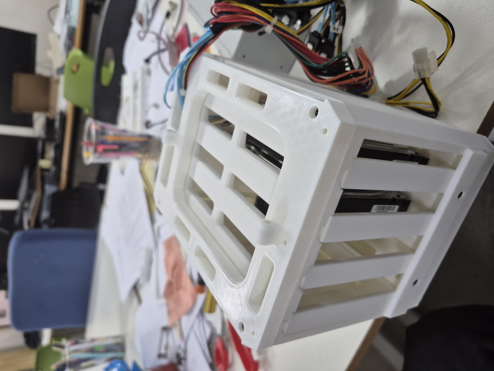
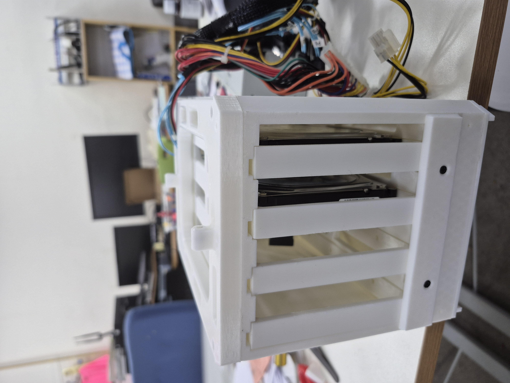


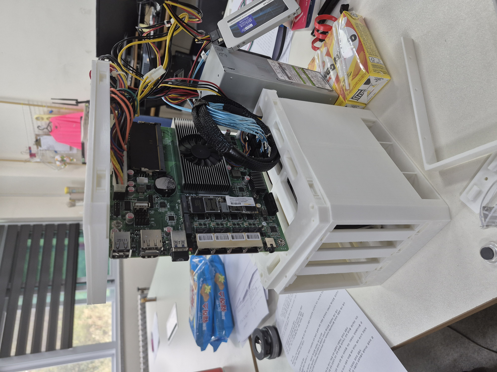
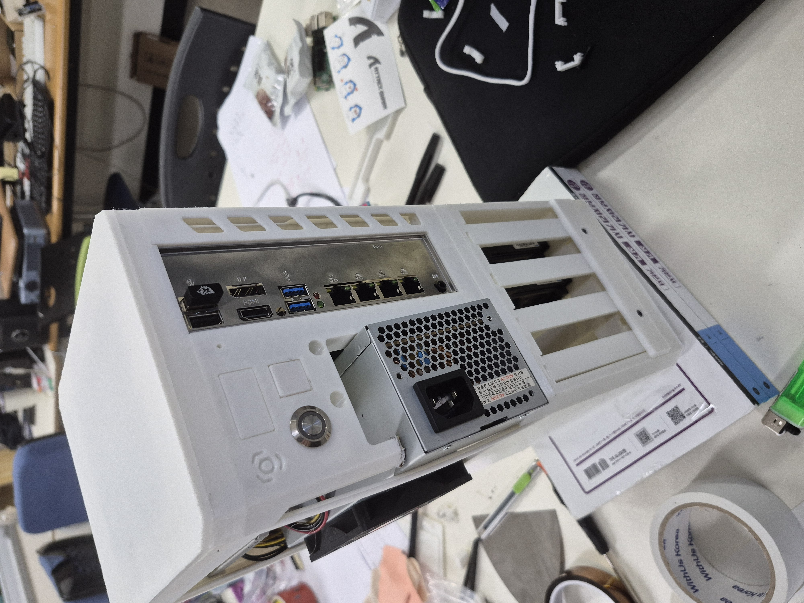
 


### 블로그
[블로그 레포](https://bloodmoon3929.duckdns.org/)
#### 사용 기술
[Quartz(타입 스크립트)](./Quartz.md), github Action, giscus, google AD, google search engine

#### 특징
- **정적 사이트 생성**: Quartz를 이용한 빠른 렌더링
- **댓글 시스템**: giscus를 통한 GitHub Discussions 연동
- **SEO 최적화**: Google Search Console 연동
- **수익화**: Google AdSense 통합

### 호스팅
#### 사용 기술
github Action, docker compose, SSL, Nginx, Load Balancing, Cloudflare

#### 내용
##### Github Actions
###### Pages
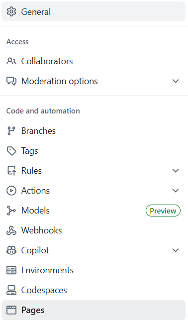
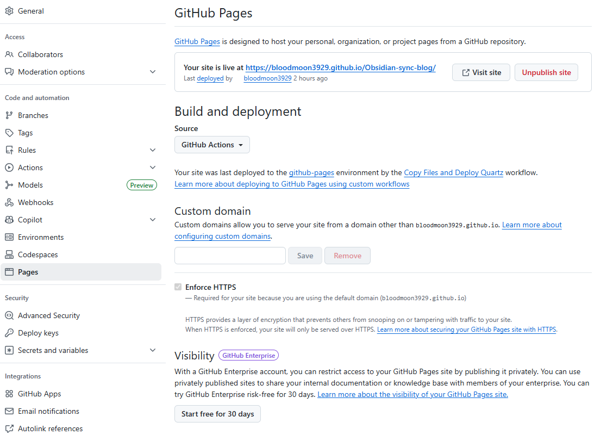

- 자동 빌드 및 배포
- `v4` 브랜치 푸시 시 자동 트리거
- Quartz 빌드 → GitHub Pages 배포

###### Workflow
```yaml
name: Copy Files and Deploy Quartz

on:
  push:
    branches:
      - v4

permissions:
  contents: write  # 파일 복사 및 커밋을 위해 write 권한 필요
  pages: write
  id-token: write

concurrency:
  group: "pages"
  cancel-in-progress: false

jobs:
  deploy:
    runs-on: ubuntu-latest
    environment:
      name: github-pages
      url: ${{ steps.deployment.outputs.page_url }}
    steps:
      - uses: actions/checkout@v4
        with:
          fetch-depth: 0

      - uses: actions/setup-node@v4
        with:
          node-version: 22

      - name: Install Dependencies
        run: npm ci

      - name: Rename image files (replace spaces with hyphens)
        run: |
          find src/site/img -depth -name "* *" -type f | while IFS= read -r file; do
            dir=$(dirname "$file")
            base=$(basename "$file")
            new="$dir/${base// /-}"
            mv "$file" "$new"
            echo "Renamed: $file -> $new"
          done

      - name: Build Quartz
        run: npx quartz build

      - name: Check built files (debug)
        run: |
          echo "=== Checking public/img/user/첨부파일/ ==="
          ls -la public/img/user/첨부파일/ || echo "Directory not found"
          echo ""
          echo "=== Checking for specific file ==="
          find public/img/user/첨부파일/ -name "*2주차*" || echo "File not found"

      - name: Upload artifact
        uses: actions/upload-pages-artifact@v3
        with:
          path: public

      - name: Deploy to GitHub Pages
        id: deployment
        uses: actions/deploy-pages@v4
```

##### docker compose
###### SSL
- Let's Encrypt 인증서 자동 갱신
- HTTPS 강제 리다이렉트

OMV corn을 통한 자동 인증

`0 3 * * 1 /srv/dev-disk-by-uuid-f17a6113-d906-465d-b0c2-67916b2feb5f/500gssd(1)/quartz-blog/docker-deployment/renew-ssl.sh`

###### yaml
```yaml
services:
  quartz-blog:
    image: node:22-slim
    container_name: quartz-blog
    restart: unless-stopped
    working_dir: /usr/src/app
    volumes:
      - /srv/dev-disk-by-uuid-f17a6113-d906-465d-b0c2-67916b2feb5f/500gssd(1)/quartz-blog:/usr/src/app
      - node_modules:/usr/src/app/node_modules
    environment:
      - NODE_ENV=production
    command: >
      sh -c "
      npm ci &&
      npx quartz build --serve --port 8082
      "
    networks:
      - quartz-network
      
  quartz-proxy:
    image: alpine/socat
    container_name: quartz-proxy
    restart: unless-stopped
    command: tcp-listen:3000,fork,reuseaddr tcp-connect:quartz-blog:8082
    depends_on:
      - quartz-blog
    networks:
      - quartz-network
      
  nginx-lb:
    image: nginx:alpine
    container_name: nginx-loadbalancer
    restart: unless-stopped
    ports:
      - "443:443"      # HTTPS (메인)
      - "2052:2052"    # 로컬 네트워크 호환성
    volumes:
      - /srv/dev-disk-by-uuid-f17a6113-d906-465d-b0c2-67916b2feb5f/500gssd(1)/quartz-blog/docker-deployment/nginx-lb.conf:/etc/nginx/nginx.conf:ro
      - /etc/letsencrypt:/etc/letsencrypt:ro  # SSL 인증서
    depends_on:
      - quartz-proxy
    networks:
      - quartz-network
    dns:
      - 8.8.8.8
      - 8.8.4.4
      - 1.1.1.1
      
volumes:
  node_modules:
    driver: local
    
networks:
  quartz-network:
    driver: bridge
```


###### webhook
- HTTP POST 요청으로 Docker 컨테이너 재시작
- 엔드포인트: `http://gnbupi.local:8099/restart-docker`
- Bearer 토큰 인증

```yaml
services:
  webhook:
    image: python:3.9-slim
    ports:
      - "8099:8099"
    volumes:
      - /srv/dev-disk-by-uuid-f17a6113-d906-465d-b0c2-67916b2feb5f/500gssd(1)/quartz-blog/docker-deployment/webhook-server.py:/app/webhook-server.py
      - /var/run/docker.sock:/var/run/docker.sock
    working_dir: /app
    command: bash -c "apt-get update && apt-get install -y docker.io && python3 webhook-server.py"
    environment:
      - WEBHOOK_TOKEN=my-secret-token-123
      - WEBHOOK_PORT=8099
```
##### Nginx Load Balancing
- **알고리즘**: IP Hash (세션 고정)
- **업스트림**: GitHub Pages + 로컬 서버
- **폴백**: GitHub Pages가 기본 폴백
- **포트**: 2052 (Cloudflare 허용 포트), 443 (SSL 가능 포트)

##### Cloudflare
###### Tunneling
- 외부에서 로컬 서버 접근 가능
- 포트 포워딩 없이 안전한 터널링

###### workers
- 세션 기반 로드 밸런싱
- 상태 체크 및 자동 폴백
- 커스텀 도메인 라우팅

### 확장 프로그램
#### 사용 기술
타입 스크립트, octokit, obsidian-sample-plugin, esbuild

#### 주요 기능
1. **단일/배치 발행**: 개별 파일 또는 여러 파일 동시 발행
2. **이미지 자동 처리**: 
   - `![[image.png]]` → `` 변환
   - Base64 인코딩 및 GitHub 업로드
   - 중복 이미지 자동 제거
3. **폴더 구조 유지**: Obsidian vault 구조 그대로 블로그에 반영
4. **상태 관리**: 
   - Unpublished (미발행)
   - Changed (수정됨)
   - Published (발행됨)
   - Deleted (삭제됨)
5. **원자적 커밋**: Git Tree API로 여러 파일을 하나의 커밋으로 통합
6. **이중 발행**: GitHub + 로컬 서버 동시 발행 지원

#### 프로젝트 구조
```
src/
├── publisher/           # 발행 로직
│   ├── IntegratedPublisher.ts    # 통합 관리자
│   ├── GitHubPublisher.ts        # GitHub API
│   ├── LocalServerPublisher.ts   # SMB 파일 복사
│   └── WebhookClient.ts          # Docker 재시작
├── types/              # 타입 정의
│   └── settings.ts
└── ui/                 # UI 컴포넌트
    ├── PublicationCenterModal.ts # 메인 UI
    ├── SettingTab.ts             # 설정 탭
    ├── StatusBar.ts              # 상태바
    └── Notification.ts           # 알림
```

#### UI
사이드바
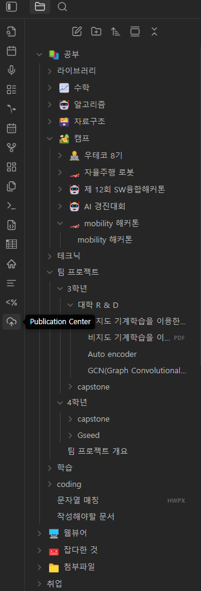

플러그인 목록


설정창
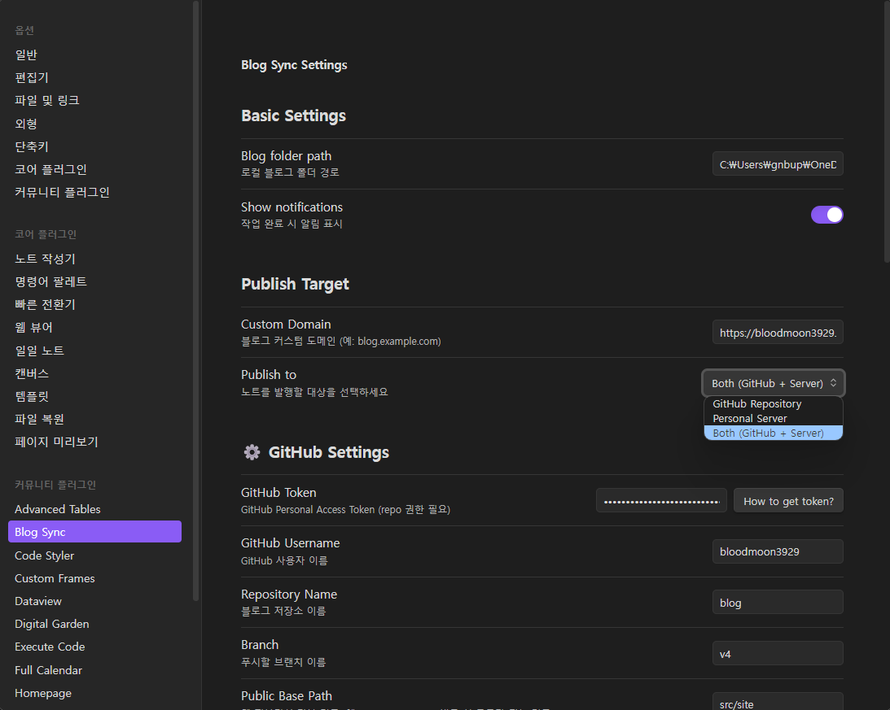


업로드 UI
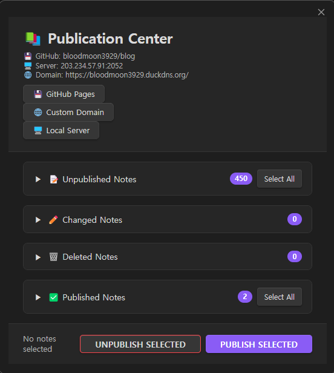

업로드 테스트
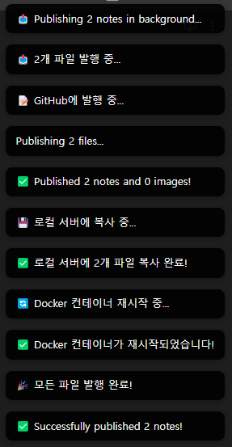
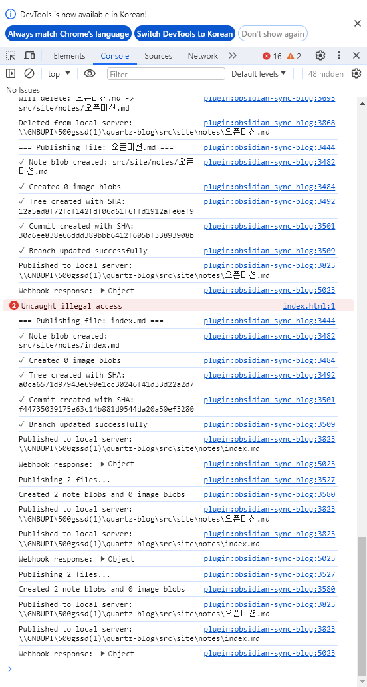

Response Header
- gihub


- local
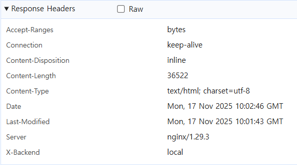

- fall back


#### [obsidian-sample-plugin](./obsidian-sample-plugin.md)
Obsidian에서 제공한 플러그인 개발 예제 이다.

다음은 개발한 플러그인에 대한 깃 주소이다.<br>
[Obsidian-sync-blog](https://bloodmoon3929.github.io/Obsidian-sync-blog/)

MVC와 유사하게 진행하였다.
- **Model**: `settings.ts` (데이터 및 상태)
- **View**: `ui/*` (UI 컴포넌트)
- **Controller**: `publisher/*` (비즈니스 로직)

#### [octokit](./octokit.md)
Github API를 편하게 쓰도록 만든 라이브러리 세트이다.

주요 사용 API:
- `git.createBlob`: 파일 콘텐츠 업로드
- `git.createTree`: 파일 구조 생성
- `git.createCommit`: 커밋 생성
- `git.updateRef`: 브랜치 업데이트

## 기술적 도전과 해결
### 1. Quartz Localhost Binding 문제
- **문제**: Quartz가 localhost에만 바인딩
- **해결**: socat 프록시 컨테이너로 Docker 네트워크 브리징

### 2. 상대 경로 에셋 로딩 문제
- **문제**: 로드 밸런싱 시 서버 전환으로 에셋 로딩 실패
- **해결**: 세션 고정 (IP Hash) + Cloudflare Workers 세션 관리

### 3. 한글 파일명 처리
- **문제**: URL 인코딩 필요
- **해결**: `encodeURIComponent`로 경로 자동 인코딩

### 4. Git 커밋 히스토리 관리
- **문제**: 파일마다 개별 커밋 생성으로 히스토리 복잡
- **해결**: Git Tree API로 원자적 커밋 구현

## 참고 자료
- [Obsidian API Docs](https://docs.obsidian.md/Plugins)
- [Quartz Documentation](https://quartz.jzhao.xyz/)
- [Octokit REST API](https://octokit.github.io/rest.js/)


## 🎯 결론: 2주간의 여정

이 프로젝트는 단순히 플러그인을 만드는 것을 넘어, **홈 서버 구축부터 클라우드 연동까지 풀스택 개발자로서의 역량을 확장**하는 기회였습니다.

### 가장 큰 교훈 3가지

**1. "완벽한 코드보다 동작하는 결과물"**
- socat 프록시는 "땜빵"처럼 보이지만, 실제로는 완벽한 해결책이었습니다.
- 2주라는 시간 안에 완성도 있는 결과물을 만들려면 **실용주의**가 필수입니다.

**2. "좋은 아키텍처는 시간을 절약한다"**
- Publisher 계층을 분리한 덕분에 GitHub → 로컬 서버 → Webhook 순차 추가가 쉬웠습니다.
- 초기 설계에 하루를 투자한 것이 나중에 일주일을 절약했습니다.

**3. "낯선 기술도 단계적으로 접근하면 정복할 수 있다"**
- Week 1: 인프라 (Docker, Nginx, SSL)
- Week 2: 플러그인 (TypeScript, Octokit, Obsidian API)
- 한 번에 모든 것을 배우려 하지 않고, **필요한 순간에 필요한 것만** 학습했습니다.

### 마무리

"오프라인 메모를 웹 블로그로"라는 목표는 달성했지만, 여전히 개선할 점이 많습니다. 
하지만 **2주 만에 동작하는 결과물을 만들었다**는 사실이 가장 뿌듯합니다.

앞으로는 이 플러그인을 Obsidian Community Plugin으로 등록하여 더 많은 사람들이 쉽게 블로그를 운영할 수 있도록 돕고 싶습니다.