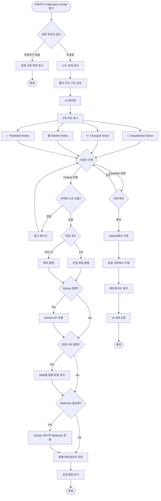
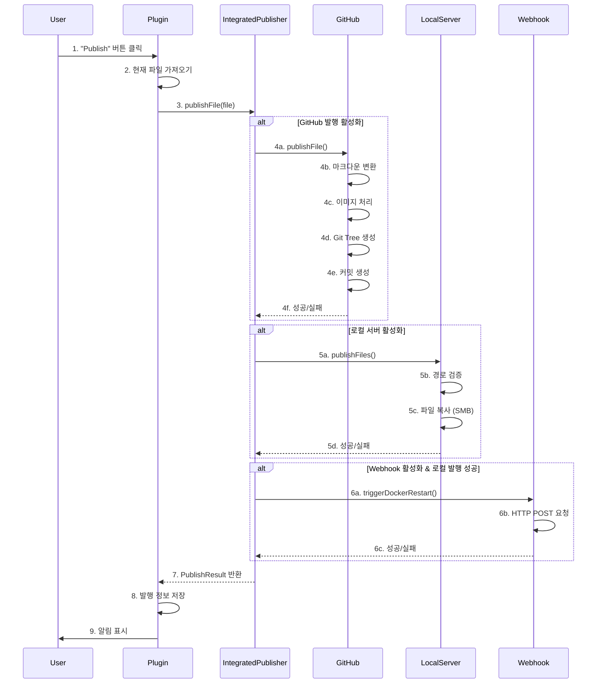
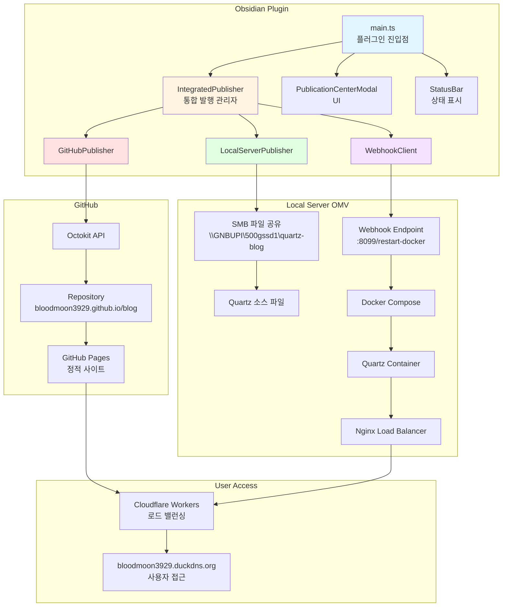

# Obsidian-sync-blog
깃허브와 개인서버로 옵시디언의 문서를 사진과 마크다운 문서로 분리하고, 옵시디언의 마크다운 문법을 공식 마크다운 문법으로 수정하여 사용자가 정해진 경로로 업로드 해주는 옵시디언 확장프로그램

## 핵심 기술 스택
- 언어: TypeScript
- 빌드: esbuild
- GitHub API: @octokit/rest
- 파일 시스템: Node.js fs 모듈
- HTTP 요청: Obsidian requestUrl API
- UI: Obsidian Plugin API

## 주요 기능
1. 발행 (Publish)
- 사용자가 노트 선택
- IntegratedPublisher가 GitHub/로컬 서버로 발행
- 마크다운 링크 변환 (![[image.png]] → ![image.png].(/src/site/img/user/image.png))
- 이미지 파일 자동 처리
- Webhook으로 Docker 재시작

2. 상태 관리
- 각 노트의 해시값 저장
- 4가지 상태 추적: Unpublished, Changed, Deleted, Published
- 폴더 구조 기반 UI


3. 배치 처리
- Git Tree API를 사용한 원자적 커밋
- 여러 파일을 하나의 커밋으로 통합
- 중복 이미지 자동 제거


## 개발 방법
### 터미널 1
```
npm run dev
```
위의 명령을 통해, src에 개발 중인 플러그인의 수정 사항이 생기면, 이것을 확인하고 문제가 없다면 main.js 파일로 변환 해줌

### 터미널 2
```
.\deply-to-vault.ps1
```
위의 명령은 다음과 같은 내용을 포함함

```ps1
$SOURCE_DIR = "C:\Users\gnbup\Desktop\wootech\Obsidian-sync-blog"
$VAULT_PLUGIN_DIR = "C:\Users\gnbup\OneDrive\Obsidian\.obsidian\plugins\obsidian-sync-blog"

Write-Host "=== Deploying Plugin to Obsidian ===" -ForegroundColor Cyan
Write-Host ""

$files = @("main.js", "manifest.json", "styles.css")

foreach ($file in $files) {
    $sourcePath = Join-Path $SOURCE_DIR $file
    $destPath = Join-Path $VAULT_PLUGIN_DIR $file
    
    if (Test-Path $sourcePath) {
        Copy-Item $sourcePath -Destination $destPath -Force
        Write-Host "[OK] $file copied" -ForegroundColor Green
    } else {
        Write-Host "[SKIP] $file not found" -ForegroundColor Yellow
    }
}

Write-Host ""
Write-Host "=== Deployment Complete ===" -ForegroundColor Green
Write-Host "Please reload Obsidian to see changes." -ForegroundColor Cyan
```

SOURCE_DIR에는 현재 이 폴더의 경로가 지정되어 있다.<br>
VAULT_PLUGIN_DIR에는 사용중인 옵시디언 vault의 플러그인 폴더의 경로로 지정되어 있다.

그 후 main.js, manifest.json, styles.css을 플러그인 폴더로 복사함으로써 플러그인을 사용할 수 있다.

## 폴더 구조
```text
Obsidian-sync-blog/
├── src/
│   ├── publisher/           # 발행 로직
│   │   ├── GitHubPublisher.ts
│   │   ├── IntegratedPublisher.ts
│   │   ├── LocalServerPublisher.ts
│   │   ├── SSHExecutor.ts
│   │   └── WebhookClient.ts
│   ├── types/              # 타입 정의
│   │   └── settings.ts
│   └── ui/                 # UI 컴포넌트
│       ├── ConnectionTestModal.ts
│       ├── Notification.ts
│       ├── PublicationCenterModal.ts
│       ├── SettingTab.ts
│       └── StatusBar.ts
├── main.ts                 # 플러그인 진입점
├── manifest.json           # 플러그인 메타데이터
├── package.json            # npm 설정
├── esbuild.config.mjs      # 빌드 설정
├── deploy-to-vault.ps1     # 배포 스크립트
└── styles.css              # 스타일시트
```

## 파일별 역할
Core Files (루트)
|파일|역할|
|----|---|
|main.ts|플러그인의 진입점. 플러그인 초기화, 커맨드 등록, UI 초기화 담당|
|manifest.json|플러그인 메타데이터 (ID, 이름, 버전, 설명)|
|package.json|npm 의존성 및 스크립트 정의|
|esbuild.config.mjs|TypeScript → JavaScript 빌드 설정|
|deploy-to-vault.ps1|개발 중인 플러그인을 Obsidian vault로 배포하는 스크립트|
|styles.css|플러그인 UI 스타일링|


Publisher Layer (src/publisher/)
|파일|역할|
|----|---|
|IntegratedPublisher.ts|통합 발행 관리자. GitHub, 로컬 서버, Webhook을 조율하는 중앙 컨트롤러|
|GitHubPublisher.ts|GitHub API를 통한 발행. Octokit 사용, Git Tree API로 원자적 커밋 생성|
|LocalServerPublisher.ts|OMV 서버로 파일 복사. SMB 경로를 통해 직접 파일시스템 접근|
|WebhookClient.ts|로컬 서버에 Webhook 호출하여 Docker 컨테이너 재시작 트리거|
|SSHExecutor.ts|(미사용) SSH를 통한 원격 명령 실행|

Types Layer (src/types/)
|파일|역할|
|----|---|
|settings.ts|플러그인 설정 타입 정의, 기본 설정값, 발행 상태 관리|

UI Layer (src/ui/)
|파일|역할|
|----|----|
|PublicationCenterModal.ts|Publication Center UI. 폴더 구조, 배치 발행, 상태 필터링|
|SettingTab.ts|플러그인 설정 탭 (GitHub, 로컬 서버, Webhook 설정)|
|StatusBar.ts|Obsidian 하단 상태바에 발행 진행 상황 표시|
|Notification.ts|알림 관리 (info, success, warning, error)|
|ConnectionTestModal.ts|연결 테스트 모달|


## 다이어그램
### Publication Center 플로우차트



### 발행 프로세스 순서도



### 아키텍처 개요 다이어그램

